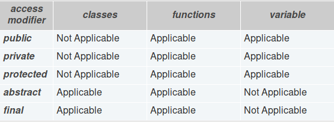
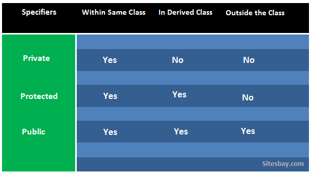
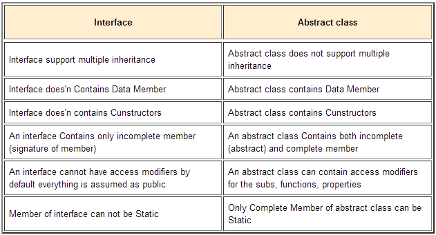

# PHP OOP


## PHP OOP


### PHP OOP
Починаючи з версії PHP 5 об'єктна модель була повністю переписана, вона стала більш продуктивною і функціональною. Це було головною зміною з версії PHP 4. У PHP 5 тепер повна об'єктна модель.


### Опис класу і ініціалізація об'єкту
Для створення класу використовується ключове слово class:

```php
<?php
class Foo {
    public $aMemberVar = 'aMemberVar Member Variable';
    public $aFuncName = 'aMemberFunc';
   
   
    function aMemberFunc() {
        print 'Inside `aMemberFunc()`';
    }
} 
```


### Опис класу і ініціалізація об'єкту
Для ініціалізації класу використовується ключове слово new:

```php
$foo = new Foo;
```


### Опис класу і ініціалізація об'єкту
Для доступу до полів класу використовується оператор стрілка(->):

```php
<?php
$element = 'aMemberVar';
print $foo->$element;
?> 
```


### Конструктор
PHP 5 дозволяє оголошувати методи-конструктори. Класи, в яких оголошено метод-конструктор, будуть викликати цей метод при кожному створенні нового об'єкта, так що це може виявитися корисним, наприклад, для ініціалізації будь-якого стану об'єкта перед його використанням.


### Конструктор
```php
<?php
class BaseClass {
   function __construct() {
       print "Конструктор класса BaseClass\n";
   }
}
```


### Деструктор
PHP 5 надає концепцію **деструкції**, аналогічну до тієї, яка застосовується в інших ООП-мовах, таких як C ++. Деструкція буде викликаний при звільненні всіх посилань на певний об'єкт або при завершенні скрипта (**порядок виконання деструкторів не гарантовано**).


### Деструктор
```php
<?php
class MyDestructableClass
{
   function __construct() {
       print "Конструктор\n";
   }

   function __destruct() {
       print "Уничтожается " . __CLASS__  . "\n";
   }
}

$obj = new MyDestructableClass();
```


### Статичні поля та методи
Оголошення властивостей і методів класу статичними дозволяє звертатися до них без створення екземпляра класу. Властивість класу, оголошене як статичне, не може бути доступно за допомогою екземпляра класу (але статичний метод може бути викликаний).

З метою сумісності з PHP 4, якщо визначення області видимості не використовується, то властивість або метод будуть оброблятися так, як якщо б він був оголошений як public.


### Статичні поля та методи
```php
<?php
class Foo {
    public static function aStaticMethod() {
        // ...
    }
}

Foo::aStaticMethod();
$classname = 'Foo';
$classname::aStaticMethod(); // PHP 5.3.0
?>
```


### Інкапсуляція
**Інкапсуляція** (encapsulation) - це механізм, який об'єднує дані і код, який маніпулює зтім даними, а також захищає і те, і інше від зовнішнього втручання або неправильного використання.


### Інкапсуляція



### Інкапсуляція
На відміну від класів і функцій PHP, ми повинні чітко вказати модифікатори доступу для змінних класу PHP. Наприклад, наступний код є недійсним, що призведе до помилки розбору PHP.

```php
class Toys {
$categories = array("puzzles","pull back","remote","soft");
...
}
```


### Наслідування
Новий клас породжується від існуючого, званого базовим класом. Похідний клас використовує члени базового класу, але може також змінювати і доповнювати їх.


### Наслідування
```php
class Foo
{
    public function printItem($string)
    {
        echo 'Foo: ' . $string . PHP_EOL;
    }
    
    public function printPHP()
    {
        echo 'PHP просто супер.' . PHP_EOL;
    }
}

class Bar extends Foo
{
    public function printItem($string)
    {
        echo 'Bar: ' . $string . PHP_EOL;
    }
}
```


### Наслідування



### Виклик контруктора батьківського класа
Конструктори, які визначені в батьківських класах не викликаються автоматично, якщо дочірній клас визначає власний конструктор. Щоб викликати конструктор, оголошений в батьківському класі, потрібно здійснити виклик parent::__construct () всередині конструктора дочірнього класу. Якщо в дочірньому класі не визначений конструктор, то він може бути успадкований від батьківського класу як звичайний метод (якщо він не був визначений як приватний).


### Виклик контруктора батьківського класа
```php
<? Php
class BaseClass {
   function __construct () {
       print "Конструктор класу BaseClass \ n";
   }
}

class SubClass extends BaseClass {
   function __construct () {
       parent :: __ construct ();
       print "Конструктор класу SubClass \ n";
   }
}

class OtherSubClass extends BaseClass {
    // успадковує конструктор BaseClass
}
```


### Абстрактний клас
**Абстрактний клас** в об'єктно-орієнтованому програмуванні - базовий клас, що не передбачає створення екземплярів.


### Абстрактний клас
```php
abstract class AbstractClass
{
    abstract protected function getValue();
    abstract protected function prefixValue($prefix);

    public function printOut() {
        print $this->getValue() . "\n";
    }
}

class ConcreteClass1 extends AbstractClass
{
    protected function getValue() {
        return "ConcreteClass1";
    }

    public function prefixValue($prefix) {
        return "{$prefix}ConcreteClass1";
    }
}
```


### Інтерфейси
**Інтерфейс** (англ. Interface) - програмна / синтаксична структура, що визначає відношення між об'єктами, які поділяють певну множину поведінок і не пов'язані ніяк інакше.

```php
interface iTemplate
{
    public function setVariable($name, $var);
    public function getHtml($template);
}
```


### abstract vs interface



### Трейти
З версії 5.4 в PHP з'явився такий цікавий механізм як домішки (trait), який за задумом розробників повинен допомогти розрулювати ситуації коли вже дуже хочеться застосувати множинне наслідування, але не можна.


### Трейти
```php
abstract class Furniture {
    protected $width;
    protected $height;
    protected $length;
    public function getDimension() {
        return [$this->width, $this->height, $this->length];
    }
}
class Table extends Furniture {
    protected $square;
    public function getSquare() {
        return $this->square;
    }
}
class Chair extends Furniture {
    protected $maxWeight;
    public function getMaxWeight() {
        return $this->maxWeight;
    }
}
class Couch extends Furniture {
}
```


### Трейти
- Якщо ж нам треба вказати матеріал оббивки меблів, то нам вже треба або вносити даний функціонал в обидва класу Chair і Couch, але це копі-паст і зовсім не ООП, або повинен з'явиться новий клас Upholstered, від якого і будуть успадковані ці класи.
- Тепер згадаємо, що деякі меблі у нас може розкладатися, і нам треба додати цю інформацію для класів Table і Couch, можна було б створити ще один клас Folding і розширювати його, але ця зміна буде конфліктувати з попереднім рішенням, і виходить, що є єдиний вихід - копіпаст методів між класами.


### Трейти
```php
abstract class Furniture {
    protected $width;
    protected $height;
    protected $length;
    public function getDimension() {
        return [$this->width, $this->height, $this->length];
    }
 
    // requirement 01
    public function getVolume() {
        return $this->width * $this->height * $this->length;
    }
 
    // requirement 02
    protected $color;
    protected $material;
    public function getColor() {
        return $this->color;
    }
    public function getMaterial() {
        return $this->material;
    }
}
 
class Table extends Furniture {
    protected $square;
    public function getSquare() {
        return $this->square;
    }
 
    // requirement 04
    protected $maxSquare;
    public function getMaxSquare() {
        return $this->maxSquare;
    }
}
 
class Chair extends Furniture {
    protected $maxWeight;
    public function getMaxWeight() {
        return $this->maxWeight;
    }
    // requirement 03
    protected $upholstery;
    public function getUpholstery() {
        return $this->upholstery;
    }
}
 
class Couch extends Furniture {
    // requirement 03
    protected $upholstery;
    public function getUpholstery() {
        return $this->upholstery;
    }
    // requirement 04
    protected $maxSquare;
    public function getMaxSquare() {
        return $this->maxSquare;
    }
}
```


### Трейти
Так тут неозброєним оком видно копіпаст, і дуже хотілося б позбавиться від нього, хотілося б реалізацію вимог 3 і 4 закинути в окремий клас, і успадковувати його, але в PHP немає множинного наслідування, може бути тільки один клас предок. І ось в PHP 5.4 на сцену виходять домішки (trait), чимось вони схожі на класи, але лише здалеку, домішки лише групують якийсь набір функціоналу під однією вивіскою, але не більше. Давайте таки опишемо необхідний функціонал в домішках:


### Трейти
```php
// requirement 03
trait Upholstery {
    protected $upholstery;
    public function getUpholstery() {
        return $this->upholstery;
    }
}
 
// requirement 04
trait MaxSquare {
    protected $maxSquare;
    public function getMaxSquare() {
        return $this->maxSquare;
    }
}
```


### Трейти
```php
class Table extends Furniture {
    // requirement 04
    use MaxSquare;
 
    protected $square;
    public function getSquare() {
        return $this->square;
    }
}
class Chair extends Furniture {
    // requirement 03
    use Upholstery;
 
    protected $maxWeight;
    public function getMaxWeight() {
        return $this->maxWeight;
    }
}
class Couch extends Furniture {
    // requirement 03
    use Upholstery;
    // requirement 04
    use MaxSquare;
}
```


### Поліморфізм
Якщо говорити коротко, **поліморфізм** - це здатність об'єкта використовувати методи похідного класу, який не існує на момент створення базового.


### Поліморфізм
```php
class poly_base_Article {
    //...
    public function write($type) {
        $ret = '';
        switch($type) {
            case 'XML':
                $ret = '<article>';
                $ret .= '<title>' . $obj->title . '</title>';
                $ret .= '<author>' . $obj->author . '</author>';
                $ret .= '<date>' . $obj->date . '</date>';
                $ret .= '<category>' . $obj->category . '</category>';
                $ret .= '</article>';
                break;
            case 'JSON':
                $array = array('article' => $obj);
                $ret = json_encode($array);
                break;
        }
        return $ret;
    }
}
```


### Поліморфізм
```php
interface poly_writer_Writer {
    public function write(poly_base_Article $obj);
}
```


### Поліморфізм
```php
class poly_writer_XMLWriter implements poly_writer_Writer {
    public function write(poly_base_Article $obj) {
        $ret = '<article>';
        $ret .= '<title>' . $obj->title . '</title>';
        $ret .= '<author>' . $obj->author . '</author>';
        $ret .= '<date>' . $obj->date . '</date>';
        $ret .= '<category>' . $obj->category . '</category>';
        $ret .= '</article>';
        return $ret;
    }
}
```


### Поліморфізм
```php
class poly_writer_JSONWriter implements poly_writer_Writer {
    public function write(poly_base_Article $obj) {
        $array = array('article' => $obj);
        return json_encode($array);
    }
}
```


### Поліморфізм
```php
class poly_base_Article {
    //...
    public function write(poly_writer_Writer $writer) {
        return $writer->write($this);
    }
}
```


### Простір імен та імпортування класів
**Repository.php**:
```php
<?php

namespace App\Repository;

class Repository{

}
```


### Простір імен та імпортування класів
**Service.php**:
```php
<?php

namespace App\Service;

require_once('Repository.php');

use App\Repository\Repository;

use App\Repository\Repository as Banana;

class Service{

    private $repository;

    public function __construct(){
        $this->repository = new Repository;
    }

}
```


### PSR
PSR - це абревіатура від Proposing a Standards Recommendation (пропоновані рекомендації стандартів), які були розроблені групою PHP Framework Interoperability Group, відома як PHP-FIG. У число учасників підтримують стандарти входять такі відомі проекти як: phpBB, PEAR, Doctrine, Composer, Propel, CakePHP, Symfony, phpDocumentor, Zend і т.д.


### PSR-0
Нижче описані обов'язкові вимоги, яких слід дотримуватися в Автозавантажувач для взаємодії.

- Повністю визначений простір імен і ім'я класу повинні мати наступну структуру: \ <Vendor Name> \ (<Namespace> \\) * <Class Name>.
- Кожен роздільник простору імен при зверненні до файлової системи перетворюється в РАЗДЕЛІТЕЛЬ_ІМЁН_КАТАЛОГОВ.
- Кожен символ _ ( «знак підкреслення») в ІМЕНІ_КЛАССА перетворюється в РАЗДЕЛІТЕЛЬ_ІМЁН_КАТАЛОГОВ. При цьому символ _ ( «знак підкреслення») не володіє ніяким особливим значенням в імені простору імен (і не зазнає перетворень).
- При зверненні до файлової системи повністю певний простір імен і ім'я класу доповнюються суфіксом .php.


### PSR-0
**Приклади**:
- \Doctrine\Common\IsolatedClassLoader => /path/to/project/lib/vendor/Doctrine/Common/IsolatedClassLoader.php
- \Symfony\Core\Request => /path/to/project/lib/vendor/Symfony/Core/Request.php
- \Zend\Acl => /path/to/project/lib/vendor/Zend/Acl.php
- \Zend\Mail\Message => /path/to/project/lib/vendor/Zend/Mail/Message.php


### PSR-1 PSR-2 PSR-3 PSR-4
Переклади PSR можна подивитися за посиланям [PSR](https://svyatoslav.biz/misc/psr_translation/#_PSR-0)


### Composer
**Composer** (getcomposer.org) - це досить популярний менеджер залежностей для PHP. Ви можете описати від яких бібліотек залежить ваш проект і Composer встановить потрібні бібліотеки за вас! Причому Composer - це не менеджер пакетів в класичному розумінні. Так, він оперує з сутностями, які ми будемо називати «пакетами» або бібліотеками, але встановлюються вони всередину кожного проекту окремо, а не глобально (це одне з основних відмінностей від старого-доброго PEAR).


### Composer
При створенні Composer автори черпали ідеї і натхнення з аналогічних проектів: npm для Node.js і Bundler для Ruby.


### Ініціалізація нового проекту
Для ініціалізації нового проекту використовується команда:
```
composer init
```
В ітерактивному режимі заповніть деталі проекту.


### Ініціалізація нового проекту
В ітерактивному режимі заповніть деталі проекту.

Виконайте команду:
```
composer install
```
Вона підтягне залежності composer і створить файл автозагрузки.


### Включення завантаження класів
Для бібліотек, які вказують інформацію про автозавантаження, Composer створює файл vendor / autoload.php. Ви можете просто включити цей файл і почати використовувати класи, що надаються цими бібліотеками без додаткової роботи:

```php
require __DIR__ . '/vendor/autoload.php';

$log = new Monolog\Logger('name');
$log->pushHandler(new Monolog\Handler\StreamHandler('app.log', Monolog\Logger::WARNING));
$log->addWarning('Foo');
```


### Включення завантаження класів
Ви навіть можете додати свій власний код до автозавантажувача, додавши поле autoload до composer.json.

```json
{
    "autoload": {
        "psr-4": {"Acme\\": "src/"}
    }
}
```


### Включення завантаження класів
Після додавання поля autoload потрібно повторно запустити **dump-autoload**, щоб повторно створити файл vendor / autoload.php.

