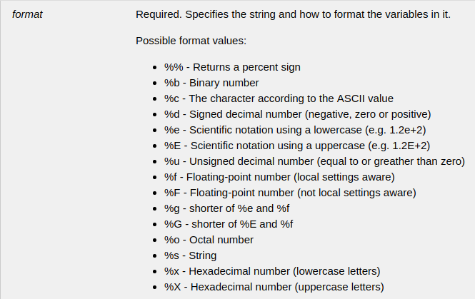
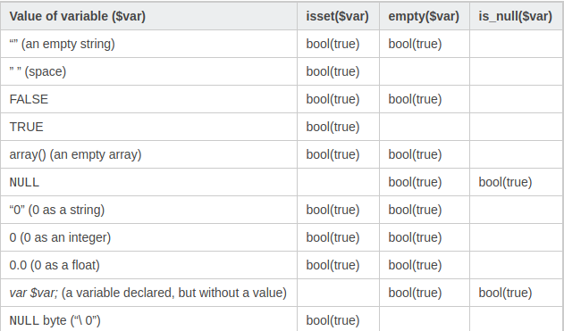
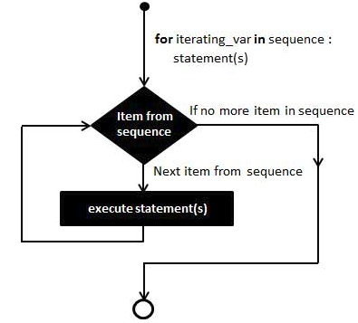
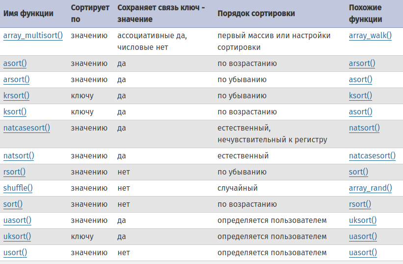
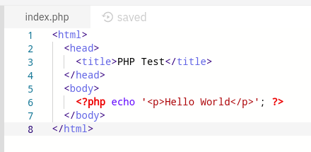

# PHP

# Зміст

${toc}

# Що таке php?

**PHP** (англ. PHP: Hypertext Preprocessor — PHP: гіпертекстовий препроцесор), попередня назва: Personal Home Page Tools — скриптова мова програмування, була створена для генерації HTML-сторінок на стороні веб-сервера. PHP є однією з найпоширеніших мов, що використовуються у сфері веб-розробок (разом із Java, .NET, Perl, Python, Ruby). PHP підтримується переважною більшістю хостинг-провайдерів. PHP — проект відкритого програмного забезпечення.

---

# Історія php?

Історія PHP починається з 1995 року, коли Расмус Лердорф (англ. Rasmus Lerdorf) створив простий застосунок мовою Perl, що аналізував відвідування користувачами його резюме на веб-сайті. Потім, коли цим застосунком вже користувалися кілька чоловік, а число охочих одержати його постійно збільшувалося, Лердорф назвав своє творіння Інструменти для особистої домашньої сторінки англ. Personal Home Page Tools версія 1 і виставив для вільного завантаження. З цієї миті почався небувалий зліт популярності PHP.

---

# Як php працює?

PHP працює з веб-сервером, який являє собою програмне забезпечення, яке доставляє веб-сторінки в інтернеті.

Якщо  PHP встановлений, веб-сервер налаштований так, щоб очікувати, певні розширення файлів, які містять вставки мови PHP. Часто розширення .php або .phtml, але будь-яке розширення можна використовувати. Коли веб-сервер отримує запит на файл з налаштованим розширенням, він надсилає HTML - стркутуру так, як є, але оператори PHP обробляються програмним забезпеченням PHP, перш ніж вони надсилаються запитувачу.

Коли PHP - вирази оброблені, веб-сервер надсилає веб-браузеру лише вихідний файл або будь-яке друковане на екрані повідомлення. Висловлювання мови PHP, які не створюють жодного виводу на екран, не входять до виходу, надісланого браузеру, тому користувач не може переглядати код PHP.

PHP не інтегрований з усіма веб-серверами, але працює з багатьма популярними веб-серверами. PHP добре працює з веб-сервером Apache. PHP також працює з Microsoft Internet Information Services (IIS) та іншими.

---

# Оголошення зміних

Змінна - це засіб для зберігання значення, такого як текстова строка «Hello World!» Або чисельне значення 4. У PHP ви визначаєте змінну наступним чином:

```php
$variable_name = Value;
```

Как ви бачите, будь-яка змінна починається зі знаком долара. Неможна про це забувати, інакше нічого працювати не буде.

Крім того, імена чутливі до регістру, тому $a і $A дві різні змінні.

```php
$text = "Hello world";
$counter = 3;
$price = 4.4;
```

---

# Типи даних

## boolean

```php
$isOk = true;
$isOk = True;
$isOk = TRUE;
```

## integer

```php
$a = 1234; // десятичне число
$a = -123; // негативне число
$a = 0123; // вісьмове число (еквівалентно 83 в десятічной системі)
$a = 0x1A; // шестнадцатеричное число (эквивалентно 26 в десятичной системі)
$a = 0b11111111; // двоєчне число (еквівалентно 255 в десятикутній системі)
```

## double

У PHP немає ніякої різниці. float, double або real є одним і тим же типом даних.

На рівні C все зберігається як double. Реальний розмір як і раніше залежить від платформи.

```php
$a = 1.234; 
$b = 1.2e3; 
$c = 7E-10;
```
## string

**Рядок** (тип string) - це набір символів, де символ - це те ж саме, що і байт. Це означає, що PHP підтримує рівно 256 різних символів, а також те, що в PHP немає вбудованої підтримки Unicode.

**Зауваження**: У PHP 7.0.0 на 64-бітних платформах немає будь-яких досяжних обмежень для довжини рядка, в 32-бітних системах і в більш ранніх версіях PHP, рядки не можуть бути більше 2 ГБ (2147483647 байт).

Рядок може бути визначена чотирма різними способами:

- Одинарні кавички

Найпростіший спосіб визначити рядок - це укласти її в одинарні лапки (символ ').

```php
echo 'это простая строка';

echo 'Также вы можете вставлять в строки
символ новой строки вот так,
это нормально';

// Выводит: Однажды Арнольд сказал: "I'll be back"
echo 'Однажды Арнольд сказал: "I\'ll be back"';

// Выводит: Вы удалили C:\*.*?
echo 'Вы удалили C:\\*.*?';
```

- Подвійні кавички

Якщо рядок знаходиться в подвійних лапках ("), PHP розпізнає наступні керуючі послідовності спеціальних символів:
\n \r \t \v \e і інші.

- heredoc

**Heredoc-текст** поводиться так само, як і рядок в подвійних лапках, при цьому їх не маючи. Це означає, що вам немає необхідності екранувати лапки в heredoc, але ви як і раніше можете використовувати керуючі послідовності.

```php
echo <<<EOD
Текст
із нової строчки і \n
фівфів
EOD;
```

- nowdoc-синтаксисом (починаючи з PHP 5.3.0)

**Nowdoc** - це те ж саме для рядків в одинарних лапках, що і heredoc для рядків в подвійних лапках. Nowdoc схожий на heredoc, але всередині нього не здійснюється ніяких підстановок. Ця конструкція ідеальна для впровадження PHP-коду або інших великих блоків тексту без необхідності його екранування.

**Nowdoc** вказується тією ж послідовністю <<<, що використовується в heredoc, але наступний за нею ідентифікатор полягає в одинарні лапки, наприклад, <<< 'EOT'.

```php
echo <<<'EOD'
Текст
із нової строчки і \n
фівфів
EOD;
```

## array

Насправді масив в PHP - це упорядкований відображення, яке встановлює відповідність між значенням і ключем. Цей тип оптимізований в декількох напрямках, тому ви можете використовувати його як власне масив, список (вектор), хеш-таблицю (що є реалізацією карти), словник, колекцію, стек, чергу і, можливо, щось ще. Так як значенням масиву може бути інший масив PHP, можна також створювати дерева і багатовимірні масиви.

### Створення масиву за допомогою array()

```php
$array = array(
    "foo" => "bar",
    "bar" => "foo",
);
```

```php
$arr = array(1,2,3);
echo gettype($arr) . "\n";
echo $arr[0];
```

key може бути або типу integer, або типу string. value може бути будь-якого типу.s

### Створення масиву за допомогою []

```php
$arr = [];
echo gettype($arr); //array
```

```php
$arr = [1,2,3];
echo gettype($arr) . "\n";
echo $arr[0];
```

```php
$arr = [1,"qwe",2.2];
echo gettype($arr) . "\n";
echo $arr[1];
```

Починаючи з PHP 5.4 можливо використовувати короткий синтаксис визначення масивів, який замінює мовну конструкцію array () на []
```php
$arr = [
    0 => 1,
    "q" => 2
];
echo gettype($arr) . "\n";
echo $arr["q"];
```

## resource

Ресурс - це спеціальна змінна, що містить посилання на зовнішній ресурс. Ресурси створюються і використовуються спеціальними функціями.

```php
// prints: mysql link
$c = mysql_connect();
echo get_resource_type($c) . "\n";

// prints: stream
$fp = fopen("foo", "w");
echo get_resource_type($fp) . "\n";

// prints: domxml document
$doc = new_xmldoc("1.0");
echo get_resource_type($doc->doc) . "\n";
```

## NULL

Спеціальне значення NULL являє собою змінну без значення.

Змінна вважається null, якщо:
- їй була присвоєна константа NULL.
- їй ще не було присвоєно ніякого значення.
- вона була видалена за допомогою unset ().

```php
$connection = NULL;
$driver = null;
$head;

echo $connection . '\n';
echo $driver . '\n';
echo $head . '\n'; //Notice: undefined variable
```

---

# print, printf, echo, 

## print

print - Виводить рядок

```php
int print ( string $arg )
```

print насправді не є справжньою функцією (це конструкція мови), тому укладати аргументи в дужки необов'язково. Завжди повертає 1.

```php
print("Hello World!!! \n");
print "Hello World!!! \n";
$res = print "Hello World!!! \n";
//you can use res. Why? I dont know :(
print $res;
```

## printf

printf - Виводить відформатований рядок. 

```php
int printf ( string $format [, mixed $args [, mixed $... ]] )
```

Повертає довжину рядка, що виводиться.

```php
$number = 9;
$str = "Beijing";
printf("There are %u million bicycles in %s.",$number,$str);
```



## echo

echo - виводить одну або більше рядків. Символ кінця рядка не додається.

```php
void echo ( string $arg1 [, string $... ] )
```

Насправді, echo - це не функція (це мовна конструкція), тому укладати аргументи в дужки необов'язково. echo (на відміну від інших мовних конструкцій) не поводиться як функція, тому не завжди може бути використана в контексті функції. До того ж, якщо ви хочете передати більше одного аргументу в echo, ці аргументи не можна укладати в дужки.

```php
echo "Hello world \n";
echo "Some text ", "Some other text \n";
echo("echo function? \n");
//echo("", ""); error
```

echo має також коротку форму, що представляє собою знак рівності, наступний безпосередньо за відкриває тегом.

```php
<!-- Cannot be inside of this &lt;?php -->
<?= 'qwe' ?>
```

Єдина відмінність від print в тому, що echo приймає список аргументів і нічого не повертає.

# Умовні оператори

## if...else

Конструкція elseif, як її ім'я і каже є поєднання if і else. Аналогічно else, вона розширює оператор if для виконання різних виразів в разі, коли умова початкового оператора if еквівалентно FALSE. Однак, на відміну від else, виконання альтернативного вираження відбудеться тільки тоді, коли умова оператора elseif буде рівним TRUE.

```php
if ($a > $b) {
    echo "a больше, чем b";
} elseif ($a == $b) {
    echo "a равен b";
} else {
    echo "a меньше, чем b";
}
```

## == ===

Оператор == використовує приведення між двома різними типами, тоді як оператор === виконує "безпечне порівняння типів". Це означає, що він поверне тільки true, якщо обидва операнди мають один і той же тип і однакове значення.

```php
1 === 1: true
1 == 1: true
1 === "1": false // 1 is an integer, "1" is a string
1 == "1": true // "1" gets casted to an integer, which is 1
"foo" === "foo": true // both operands are strings and have the same value
```

---

# Перевірка значення на існування

## isset()

> isset — Determine if a variable is set and is not NULL

```php
$var1 = NULL;
$var2 = 0;

if(isset($var1)){
    echo 'var1 isset == true' . "\n";
}

if(isset($var2)){
    echo 'var2 isset == true';
}
```

## empty()

> empty — Determine whether a variable is empty. In other words, it will return true if the variable is an empty string, false, array(), NULL, “0?, 0, and an unset variable.

```php
$var1 = NULL;
$var2 = 0;

if(empty($var1)){
    echo 'var1 empty == true' . "\n";
}

if(empty($var2)){
    echo 'var2 empty == true';
}
```

## is_null()

> is_null — Finds whether a variable is NULL. In other words, it returns true only when the variable is null. is_null() is opposite of isset(), except for one difference that isset() can be applied to unknown variables, but is_null() only to declared variables.

## isset vs empty vs is_null


---

# Цикли

## Цикл з передумовою while


```php
while (condition) {
   code to be executed;
}
```

```php
$i = 5;

while(--$i > 0){
    echo $i;
}
```

## Цикл з післяумовою do...while

```php
do {
   code to be executed;
}
while (condition);
```

```php
$i = 1;

do{
    echo $i;
} while(--$i);
```

## Цикл з лічильником for



```php
for (initialization; condition; increment){
   code to be executed;
}
```

```php
for($i = 0; $i < 5; $i++){
    echo $i;
}
```

## break, continue

> **break** перериває виконання поточної структури for, foreach, while, do-while або switch.

> **break** приймає необов'язковий числовий аргумент, який повідомляє йому виконання якої кількості вкладених структур необхідно перервати. Значення за замовчуванням 1, тільки найближча структура буде перервана.

```php
$arr = array('один', 'два', 'три', 'четыре', 'стоп', 'пять');
foreach ($arr as $val) {
    if ($val == 'стоп') {
        break;    /* Тут можно было написать 'break 1;'. */
    }
    echo "$val<br />\n";
}
```

```php
$i = 0;
while (++$i) {
    switch ($i) {
        case 5:
            echo "Итерация 5<br />\n";
            break 1;  /* Выйти только из конструкции switch. */
        case 10:
            echo "Итерация 10; выходим<br />\n";
            break 2;  /* Выходим из конструкции switch и из цикла while. */
        default:
            break;
    }
}
```

> **continue** використовується всередині циклічних структур для пропуску решти поточної ітерації циклу і, при дотриманні умов, початку наступної ітерації.

**Зауваження**: У PHP оператор switch вважається циклічним і всередині нього може використовуватися continue. Якщо continue не передана аргументів, то він поводиться аналогічно break. Якщо switch розташований всередині циклу, continue 2 продовжить виконання зовнішнього циклу з наступної ітерації.

## Використовуючи ітератор

Масиви в PHP є впорядкованими хеш-таблицями (елементи хешу об'єднані в двусвязний список) і foreach обходить масив.

```php
foreach([array_variable] as [key] => [value])
```

```php
$arr = [1,2,3];

foreach($arr as $key => $value){
    echo $key . '=>' . $value . "\n";
}
```

---

# Робота із рядками

## Конткатенація рядків

У PHP є два оператори для роботи з рядками (string). Перший - оператор конкатенації ('.'), Який повертає рядок, що представляє собою з'єднання лівого і правого аргументу. Другий - оператор присвоювання з конкатенацией ('. ='), Який приєднує правий аргумент до лівого.

```php
$a = "Привет, ";
$b = $a . "Мир!"; // $b теперь содержит строку "Привет, Мир!"

$a = "Привет, ";
$a .= "Мир!";     // $a теперь содержит строку "Привет, Мир!"
```

## Довжина рядка

В php 4,5,7 довжину рядка можна дізнатися за допомогою функції int strlen ( string $string ).

```php
$text = "some text variable";
echo strlen($text);
```

Також, можна використати функцію int iconv_strlen ( string $str [, string $charset = ini_get("iconv.internal_encoding") ] ).
На відміну від strlen (), iconv_strlen () враховує кодування рядка. Довжина рядка не обов'язково буде відповідати кількості байт в ній, так як в різних кодуваннях різні символи кодуються різною кількістю байт, наприклад, юнікод може бути і дво-, і четирёхбайтним.

```php
$text = "some text variable";
echo iconv_strlen($text,'UTF-8');
```

## Заміна символів в рядках

str_replace - Замінює всі входження рядка пошуку на рядок заміни.

```php
$bodytag = str_replace("%body%", "black", "<body text='%body%'>");
```

## Пошук в рядках

strripos - Повертає позицію останнього входження підрядка без урахування регістру.

```php
int strripos ( string $haystack , mixed $needle [, int $offset = 0 ] )
```

Шукає позицію останнього входження підрядка needle в рядок haystack.

```php
$haystack = 'ababcd';
$needle   = 'aB';

$pos      = strripos($haystack, $needle);

if ($pos === false) {
    echo "К сожалению, ($needle) не найдена в ($haystack)";
} else {
    echo "Поздравляем!\n";
    echo "Последнее вхождение ($needle) найдено в ($haystack) в позиции ($pos)";
}
```

---

# Робота з масивами

## Кількість елементів у масиві

**count** - Підраховує кількість елементів масиву або щось в об'єкті.

```php
int count ( mixed $array_or_countable [, int $mode = COUNT_NORMAL ] )
```

Якщо необов'язковий параметр mode встановлений в COUNT_RECURSIVE (або 1), count () буде рекурсивно підраховувати кількість елементів масиву. Це особливо корисно для підрахунку всіх елементів багатовимірних масивів.

```php
$a[0] = 1;
$a[1] = 3;
$a[2] = 5;
var_dump(count($a));
```

## Додавання елементів в масив

Функція array_push () вставляє один або більше елементів до кінця масиву.

```php
array_push(array,value1,value2...)
```

```php
$a=array("red","green");
array_push($a,"blue","yellow");
print_r($a);
```

## Видалення пустих елементів з масиву

```php
$array = array("geeks", 11, '', null, 12,  
            "for", 1997, false, "geeks"); 
              
// Function to remove empty elements 
// from array 
$filtered_array = array_filter($array); 
  
// Display the filtered array 
var_dump($filtered_array); 
```

## Видалення елементу за допомогою unset()

```php
$arr = [1,2,3];
echo "Array before: \n";
var_dump($arr);

unset($arr[0]);

echo "Array after: \n";

var_dump($arr);
```

## Видалення останнього елементу в масиві

Функція array_pop () видаляє останній елемент масиву.

```php
array_pop(array)
```

```php
$a=array("red","green","blue");
array_pop($a);
print_r($a);
```

## Пошук елемента у масиві

array_search - Здійснює пошук даного значення в масиві і повертає ключ першого знайденого елемента в разі успіху.

```php
mixed array_search ( mixed $needle , array $haystack [, bool $strict = FALSE ] )
```

Шукає в haystack значення needle. Якщо третій параметр strict встановлений в TRUE, то функція array_search () буде шукати ідентичні елементи в haystack. Це означає, що також будуть перевірятися типи needle в haystack, а об'єкти повинні бути одним і тим же примірником.

## Ітерація

### for

```php
$arr = [1,2,3];
for($i = 0; $i < count($arr); $i++){
    echo $arr[$i];
}
```

### foreach

```php
$arr = [1,2,3];

foreach($arr as $value){
    echo $value;
}

echo "\n";

foreach($arr as $key => $value){
    echo $key . '=>' .$value . "\n";
}
```

## Сортування елементів в масиві



## PHP 5 Array Functions 

[PHP 5 Array Functions ](https://www.w3schools.com/php/php_ref_array.asp)

---

# Функції

## Що таке функції

- Функція є блоком операторів, які можна використовувати повторно в програмі.
- Функція не виконуватиметься відразу ж при завантаженні сторінки.
- Функція буде виконуватися за допомогою виклику функції.

Синтаксис оголошення функції:
```php
function functionName() {
    code to be executed;
}
```

## Параметри функції

Інформація може передаватися функціям через аргументи. Аргумент подібний до змінної. Аргументи задаються після імені функції, в дужках. Ви можете задати стільки аргументів, скільки хочете, просто відділіть їх комою.

```php
function sayHello($helloText){
    echo $helloText;
}
```

## Значення за замовчуванням

```php
function sayHello($helloText = "Hello World!!!"){
    echo $helloText;
}
```

## Повернення результату функції

Щоб функція повернула значення, використовуйте оператор return:

```php
function sum($a, $b){
    return $a + $b;
}
```

## Виклик функції

Для того щоб викликати функцію, потрібно написати її ім'я і в дужках передати необхідні параметри.

```php
function sum($a, $b){
    return $a + $b;
}

$result = sum(1,2);

echo $sum;
```

---

# Callbacks

```php
function doIt($callback)
{
	$data = "Data from high order function";
	$callback($data);
}

function myCallback($data)
{
	echo $data;
}

doIt('myCallback');
```

В PHP 5.3 можна так:

```php
function doIt($callback)
{
	$data = "Data from high order function";
	$callback($data);
}

doIt(function($data){
	echo $data;
});
```

# Тип object

Об'єкт - це сукупність даних (властивостей) і функцій (методів) для їх обробки.

```php
$obj = array(
    "someVar" => "some arr value",
    "printSomeVar" => function(){
        echo "func inside array";
    }
);

$obj["printSomeVar"]();
```

## Створення нового об'єкту

### Створення об'єкта із масива

```php
$obj = (object) array('1' => 'foo');
var_dump(isset($obj->{'1'})); // выводит 'bool(false)'
var_dump(key($obj)); // выводит 'int(1)'
```

### Створення об'єкта за допомогою stdClass

```php
$genericObject = new stdClass();
var_dump($genericObject);
```

## Додавання і видалення властивостей

```php
$genericObject = new stdClass();
var_dump($genericObject);

$genericObject->name = "Some name";
var_dump($genericObject);

unset($genericObject->name);
var_dump($genericObject);
```

## Ітерація по властивостям

```php
$obj = new stdClass();
$obj->name = "Some name";

foreach($obj as $key => $value){
    echo $key . '=>' . $value . "\n";
}
```

# Домашня робота

Відкрийте [repl.it](https://repl.it/). Створіть новий repl -  PHP Web server:


Всередині тега <?php > реалізайте завдання згідно із варіантом:



## Варіанти

# Контрольні запитання

1. Що таке PHP? Як PHP працює?
2. Назвіть базові типи PHP?
3. Як влаштовані масиви в PHP?
4. Назвіть відміність між echo, print, printf.
5. Поясніть тип object в PHP.
