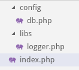
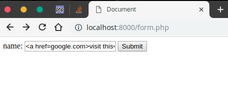
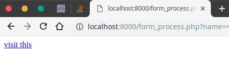
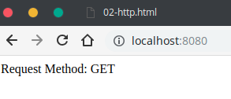
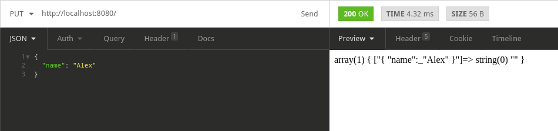
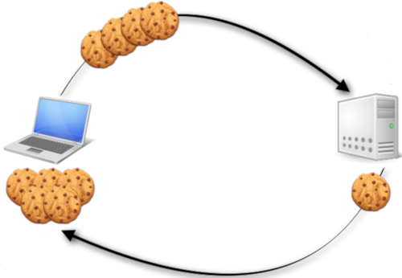
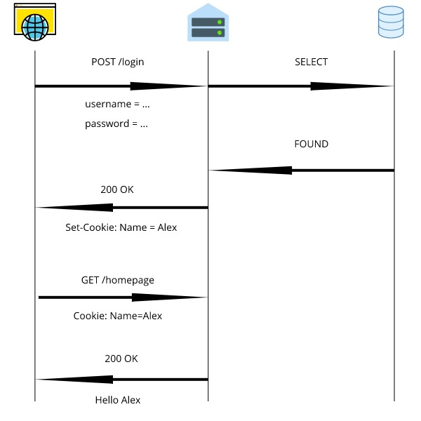

# Робота із HTTP, COOKIE, SESSION

# Зміст

${toc}

# Включення php - скриптів в інші php - скрипти

Для того, щоб імпортувати один скрипт в інший в PHP доступні наступні конструкції:

- require
- require_once
- include
- include_once

```php
include 'vars.php';
include_once 'vars.php';
require 'vars.php';
require_once 'vars.php';
```

Потрібно використовувати:
- **require** потрібно використовувати,коли программа не зможе працювати без цього файлу, наприклад, важливий шаблон, повідомлення або файл, що містить конфігураційні змінні, без яких програма не зможе коректно працювати.
- **require_once** потрібно використовувати,коли файл містить контент, який призводить до помилки при подальшому включенні, наприклад, Функція important () {/ * важливий код * /}, безумовно, потрібна у вашій програмі, але функції не можуть бути повторно оголошені, отже, не повинні бути включені знову.
- **include** потрібно використовувати, коли файл не є необхідним, і потік програми повинен продовжуватися, коли його не знайдено.
- **include_once** потрібен для включення необов'язкових залежностей, які призведуть до помилок при наступному завантаженні або, можливо, віддаленому включенні файлів.

Уявімо наступну структуру проекту:



Тоді, можна використати наступні включення у файлі index.php:

```php

<?php
require_once 'config/db.php';
include_once 'libs/logger.php'

?>
```

Це лише один із варіантів включення. Все залежить від проекту і констексту, тому кінцевий вибір залишається за Вами.

# Обробка параметрів, переданих за допомогою HTTP - методів

## HTTP GET

**GET** використовується для запиту даних із зазначеного ресурсу.

Зауважте, що рядок запиту (пари імен / значень) надсилається в URL-адресі запиту GET:
```bash
/test/demo_form.php?name1=value1&name2=value2
```

Що потрібно знати, при використанні GET:
- Запити GET можна кешувати
- Запити GET залишаються в історії браузера
- Запити GET можна додавати до закладки
- Запити GET ніколи не повинні використовуватися при роботі з конфіденційними даними
- Запити GET мають обмеження довжини
- Запити GET використовуються лише для запиту даних (не зміни)

Для роботи із GET - параметрами використовується змінна $_GET.
> $_GET - Ассоціативний массив зміних, переданих PHP - скриптові через параметри URL (відомі також як строка запиту). Зауважте, що масив не тільки заповняється для GET - запитів, а також для всіх запитів, які оформленні у вигляді строки запиту.

```php
<?php
echo 'Привет, ' . htmlspecialchars($_GET["name"]) . '!';
?>
```

Мається на увазі, що користувач ввів в браузері адресу /?name=Иван

Зверніть увагу на функцію htmlspecialchars(), ця функція перетворює html теги у відповідні
стуктури наприклад:

- '&' (амперсанд) преобразуется в '&&amp;'
- '"' (двойная кавычка) преобразуется в '&&quot;' when ENT_NOQUOTES is not set.
- ''' (одиночная кавычка) преобразуется в '&&#039;' только в режиме ENT_QUOTES.
- '<' (знак "меньше чем") преобразуется в '&&lt;'
- '>' (знак "больше чем") преобразуется в '&&gt;'

Якщо ми не будемо обробляти передані користувачем дані, можна опинитися в доволі небезпечній ситуації. Нехай у нас є файл form.php, який містить форму, яка за допомогою методу GET відправляє параметр name на скрипт form_process.php. form_process.php в свою чергу виводить даний параметр.

form.php:
```php
<!DOCTYPE html>
<html lang="en">
<head>
    <meta charset="UTF-8">
    <meta name="viewport" content="width=device-width, initial-scale=1.0">
    <meta http-equiv="X-UA-Compatible" content="ie=edge">
    <title>Document</title>
</head>
<body>
    <form action="form_process.php">
    name: <input type="text" name="name" />
    <input type="submit" value="Submit">
    </form>
</body>
</html>
```

form_process.php:
```php
<?php

$name = $_GET['name'];

echo $name;
```

Якщо користувач введе текст, який представляє собою html - теги, або javascript можна опинитися в ситуації, яка призведе до проблем з безпекою:





## HTTP POST

POST використовується для передачі даних на сервер для створення / оновлення ресурсу.

Дані, надіслані на сервер з POST, зберігаються в тілі HTTP-запиту:

```http
POST /test/demo_form.php HTTP/1.1
Host: w3schools.com
name1=value1&name2=value2
```

Деякі інші примітки щодо запитів POST:

- Запити POST ніколи не кешуються
- Запити POST не залишаються в історії веб-переглядача
- Запити POST не можна додавати до закладки
- Запити POST не мають обмежень щодо довжини даних

Для роботи із POST >парметрами в PHP використовується змінна $_POST

> $_POST - Асоціативний масив даних, переданих скрипту через HTTP методом POST при використанні application / x-www-form-urlencoded або multipart / form-data в заголовку Content-Type запиту HTTP.

```php
<?php
echo 'Привет ' . htmlspecialchars($_POST["name"]) . '!';
?>
```

## Інші HTTP - методи

Для роботи із GET і POST запитами PHP має зручний інструментарій. Що стосується інших HTTP методів не все так хорошо.
Спочатку нам потрібно познайомитися із $_SERVER.

### $_SERVER

Змінна **$ _SERVER** - це масив, що містить інформацію, таку як заголовки, шляхи та місця розташування скриптів. Записи в цьому масиві створюються веб-сервером. Немає гарантії, що кожен веб-сервер надасть будь-яку з них; сервер може опустити деякі з них або надати інші, не зазначені тут. Тим не менш, багато ці змінні присутні в [специфікації CGI / 1.1](http://www.faqs.org/rfcs/rfc3875.html), так що ви можете очікувати їх наявність.

Давайте розглянемо деякі із елементів масива $_SERVER:

- **'SERVER_ADDR'** IP-адреса сервера, на якому виконується поточний скрипт.
- **'SERVER_NAME'** Ім'я хоста, на якому виконується поточний скрипт. Якщо скрипт виконується на віртуальному хості, тут буде містяться ім'я, визначене для цього віртуального хоста.
- **'REQUEST_METHOD'** Який метод був використаний для запиту сторінки; наприклад 'GET', 'HEAD', 'POST', 'PUT'.
- **'REMOTE_ADDR'** IP-адреса, з якого користувач переглядає поточну сторінку.

```php
<?php

if(isset($_SERVER['REQUEST_METHOD'])){
	echo "Request Method: " . $_SERVER['REQUEST_METHOD'];
}

if(isset($_SERVER['SERVER_ADDR'])){
	echo "Server ADDR: " . $_SERVER['SERVER_ADDR'];
}
```

Вивід, який ми отримаємо запустивши цей скрипт на вбудованому PHP - сервері:



### Приклад роботи із PUT - запитом

Використовуючи HTTP - методи: PUT, PATCH, DELETE на стороні PHP вам просто потрібно прочитати, який метод HTTP використовується, щоб ви могли зробити дію відповідно до цього.

```php
<?php

$method = $_SERVER['REQUEST_METHOD'];
if ('PUT' === $method) {
    parse_str(file_get_contents('php://input'), $_PUT);
    var_dump($_PUT); //$_PUT contains put fields 
}
```



# Робота із HTTP - заголовками

Для відправки HTTP - заголовка в PHP використовується функція header:

```php
header ( string $header [, bool $replace = TRUE [, int $http_response_code ]] ) : void
```

Пам'ятайте, що функцію header () можна викликати тільки якщо клієнту ще не передавалися дані. Тобто вона повинна йти першою у висновку, перед її викликом не повинно бути ніяких HTML-тегів, порожніх рядків і т.п. Досить часто виникає помилка, коли при читанні коду файловими функціями, на кшталт include або require, в цьому коді трапляються прогалини або порожні рядки, які виводяться до виклику header (). Ті ж проблеми можуть виникати і при використанні PHP / HTML в одному файлі.

```php
<html>
<?php
/* Этот пример приведет к ошибке. Обратите внимание
 * на тег вверху, который будет выведен до вызова header() */
header('Location: http://www.example.com/');
exit;
?>
```

Приклади встановлення заголовків:
```php
<?php
header("HTTP/1.0 404 Not Found");
?>
```


# Робота із COOKIE

> Cookie (кукі) представляють невеликі набори даних (не більше 4 кбайт), за допомогою яких веб-сайт може зберегти на комп'ютері користувача будь-яку інформацію. За допомогою куки можна відстежувати активність користувача на сайті: залягання користувач на сайті чи ні, відстежувати історію його візитів і т.д.



## Встановлення Cookie

Для збереження Cookie на комп'ютері користувача використовується функція setcookie (). Вона має таке визначення:

```php
bool setcookie(string $name, string $value, int $expire, 
	string $path, string $domain, bool $secure, bool $httponly);
```

- **name**: ім'я cookie, яке буде використовуватися для доступу до його значення
- **value**: значення або вміст cookie - будь-який алфавітно-цифровий текст не більше 4 кбайт
- **expire** (необов'язковий параметр): термін дії, після якого cookie знищуються. Якщо даний параметр не встановлений або дорівнює 0, то знищення cookie відбувається після закриття браузера.
- **path** (необов'язковий параметр): шлях до каталогу на сервері, для якого будуть доступні cookie. Якщо задати '/', cookie будуть доступні для всього сайту. Якщо задати, наприклад, '/ mydir /', cookie будуть доступні тільки з каталогу / mydir / 'і всіх його підкаталогів. Заводський параметр є поточний каталог, в якому встановлюються cookie.
- **domain** (необов'язковий параметр): задає домен, для якого будуть доступні cookie. Якщо це домен другого рівня, наприклад, localhost.com, то cookie доступні для всього сайту localhost.com, в тому числі і для його піддоменів типу blog.localhost.com.
- **secure** (необов'язковий параметр): вказує на те, що значення cookie має передаватися по протоколу HTTPS. Якщо задано true, cookie від клієнта буде передано на сервер, тільки якщо встановлено захищене з'єднання. За замовчуванням дорівнює false.
- **httponly** (необязательный параметр): если равно true, cookie будут доступны только через http протокол. То есть cookie в этом случае не будут доступны скриптовым языкам, например, JavaScript. По умолчанию параметр равен false

```php
$key = 'message';
$value = 'Hello World';
setcookie($key, $value);
setcookie('temp','temp', time()+3600); // срок дії 1 година
```

## Читання переданих Cookie

Щоб отримати cookie, можна використовувати глобальний асоціативний масив $_COOKIE:

```php
if (isset($_COOKIE['message'])) echo $_COOKIE['message']);
```

## Видалення Cookie

Для видалення cookie досить в якості терміну дії вказати будь-який час в минулому:

```php
setcookie ("message", "", time() - 3600);
```

## Реалізація авторизація за допомогою Cookie



- Репозиторій: [php-examples](https://github.com/endlesskwazar/php-examples.git)
- Гілка: cookie-auth


# Робота із SESSION

## Реалізація авторизації за допомогою Cookie і Session


# Домашнє завдання

## Варіанти

1. qwe
2. qwe
3. sdf
4. sdf
5. sdf
6. sdf
7. sdf
8. sdf
9. sdf
10. sdf

# Контрольні запитання

1. Яка різниця між include, include_once, require, require_once?
2. Як в PHP можна встановити HTTP заголовки?
3. Як в PHP можна працювати з HTTP Cokkie?
4. Як в PHP можна працювати із HTTP Session?
5. Опишіть процес захисту ресурсів за допомогою Cookie і Session.

