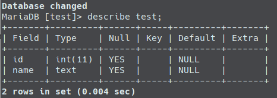
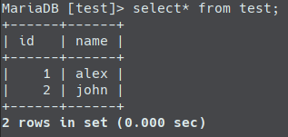
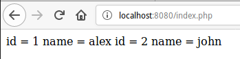
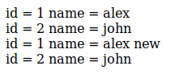
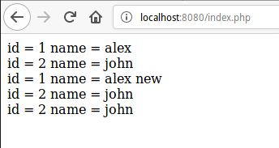
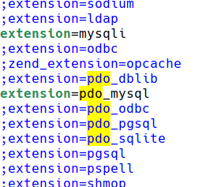
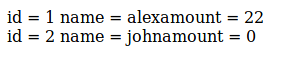
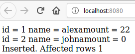
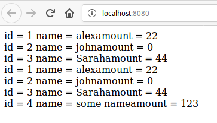
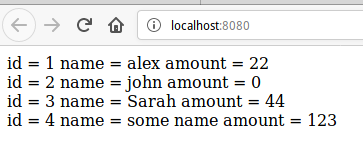

# Робота із базою даних в PHP

# Зміст

# mysqli

**Розширення mysqli**, або як його ще називають поліпшене (improved) розширення MySQL, було розроблено, щоб дати можливість програмістам в повній мірі скористатися функціоналом MySQL-сервера версій 4.1.3 і вище. Розширення mysqli включається в поставку PHP версій 5 і вище.

Для ввімкнення розширення потрібно(модифікувати php.ini):
1. Встановити директорію розширень

```ini
; Directory in which the loadable extensions (modules) reside.
; http://php.net/extension-dir
; extension_dir = "./"
; On windows:
extension_dir = "C:/php/ext"
```

2. Розкоментувати потрібне розширення

```ini
extension=php_mysqli.dll
```

## З'єднання із базою даних

Для відкриття з'єднання із базою даних потрібно в конструктор mysqli передати параметри підключення:

```php
$mysqli = new mysqli("localhost", "user", "password", "database");
```

## Виконання запитів

За виконання запитів відповідають функції **mysqli_query()**, **mysqli_real_query()** і **mysqli_multi_query()**. Найчастіше застосовується функція **mysqli_query()**, так як вона виконує відразу два завдання: виконує запит і буферизует на клієнті результат цього запиту (якщо він є). Виклик **mysqli_query()** ідентичний послідовному викликом функцій **mysqli_real_query ()** і **mysqli_store_result()**.

## DDL

```php
<?php
$mysqli = new mysqli("localhost", "root", "", "test");
$mysqli->query("DROP TABLE IF EXISTS test");
$mysqli->query("CREATE TABLE test(id INT, name text)");
```



## Виконання CRUD

### CREATE

```php
$mysqli->query("INSERT INTO test(id,name) VALUES (1,'alex'), (2, 'john');");
```



### READ

```php
$res = $mysqli->query("SELECT * FROM test;");

while ($row = $res->fetch_assoc()) {
    echo " id = " . $row['id'] . " name = ". $row['name'] . "\n";
}
```



### UPDATE

```cpp
$res = $mysqli->query("SELECT * FROM test;");

while ($row = $res->fetch_assoc()) {
    echo " id = " . $row['id'] . " name = ". $row['name'] . "<br>";
}

$mysqli->query("UPDATE test set name = 'alex new' where id = 1;");

$res = $mysqli->query("SELECT * FROM test;");

while ($row = $res->fetch_assoc()) {
    echo " id = " . $row['id'] . " name = ". $row['name'] . "<br>";
} 
```



### DELETE

```php
$mysqli->query("DELETE FROM test where id = 1;");
```



### Весь код проекту

```php
<?php
$mysqli = new mysqli("localhost", "root", "", "test");
$mysqli->query("DROP TABLE IF EXISTS test");
$mysqli->query("CREATE TABLE test(id INT, name text)");

$mysqli->query("INSERT INTO test(id,name) VALUES (1,'alex'), (2, 'john');");

$res = $mysqli->query("SELECT * FROM test;");

while ($row = $res->fetch_assoc()) {
    echo " id = " . $row['id'] . " name = ". $row['name'] . "<br>";
}

$mysqli->query("UPDATE test set name = 'alex new' where id = 1;");

$res = $mysqli->query("SELECT * FROM test;");

while ($row = $res->fetch_assoc()) {
    echo " id = " . $row['id'] . " name = ". $row['name'] . "<br>";
}

$mysqli->query("DELETE FROM test where id = 1;");

$res = $mysqli->query("SELECT * FROM test;");

while ($row = $res->fetch_assoc()) {
    echo " id = " . $row['id'] . " name = ". $row['name'] . "<br>";
}
```

## Обробка помилок

```php
<?php
$mysqli = new mysqli("localhost", "root", "", "test");

if ($mysqli->connect_errno) {
    echo "Connection Error: (" . $mysqli->connect_errno . ") " . $mysqli->connect_error;
}

if(!$mysqli->query("DROP TABLE IF EXISTS test") || !$mysqli->query("CREATE TABLE test(id INT, name text)")){
	echo "Error while creating shema: (" . $mysqli->errno . ") " . $mysqli->error;
}

if(!$mysqli->query("INSERT INTO test(id,name) VALUES (1,'alex'), (2, 'john');")){
	echo "Cant insert: (" . $mysqli->errno . ") " . $mysqli->error;
}


$res = $mysqli->query("SELECT * FROM test;");

while ($row = $res->fetch_assoc()) {
    echo " id = " . $row['id'] . " name = ". $row['name'] . "<br>";
}

$mysqli->query("UPDATE test set name = 'alex new' where id = 1;");

$res = $mysqli->query("SELECT * FROM test;");

while ($row = $res->fetch_assoc()) {
    echo " id = " . $row['id'] . " name = ". $row['name'] . "<br>";
}

$mysqli->query("DELETE FROM test where id = 1;");

$res = $mysqli->query("SELECT * FROM test;");

while ($row = $res->fetch_assoc()) {
    echo " id = " . $row['id'] . " name = ". $row['name'] . "<br>";
}
```

## Транзакції

Алгоритм, при роботі із транзакціями:
- Почніть транзакцію за допомогою команди mysqli_begin_transaction.
- Виконайтеодну або більше команд SQL, наприклад SELECT, INSERT, UPDATE або DELETE.
- Перевірте, чи немає помилки і все відповідає вашим вимогам.
- Якщо є якісь помилки, то виконайте команду ROLLBACK, інакше виконайте команду COMMIT.

Синтаксис:

```php
mysqli_begin_transaction ( mysqli $link [, int $flags = 0 [, string $name ]] ) : bool
```

Коректні прапори:

- MYSQLI_TRANS_START_READ_ONLY: Стартувати транзакцію як "START TRANSACTION READ ONLY". Потрібно MySQL 5.6 або вище.
- MYSQLI_TRANS_START_READ_WRITE: Стартувати транзакцію як "START TRANSACTION READ WRITE". Потрібно MySQL 5.6 або вище.
- MYSQLI_TRANS_START_WITH_CONSISTENT_SNAPSHOT: Стартувати транзакцію як "START TRANSACTION WITH CONSISTENT SNAPSHOT".

До використання транзакцій:
```php

```

Після використання транзакцій:
```php
```

# pdo

**PDO** (PHP Data Objects) - розширення PHP, яке реалізує взаємодію з базами даних за допомогою об'єктів. Профіт в тому, що відсутня прив'язка до конкретної системи управління базами даних.

Наданий інтерфейс підтримує, серед інших, такі популярні СУБД:

- MySQL;
- SQLite;
- PostgreSQL;
- Microsoft SQL Server.

Драйвери PDO можуть бути вимкнутими:



Порівняльна характеристика mysqli і PDO:

||PDO|mysqli|
|-|-|-|
|Підтримка БД|12 різних драйверів|Тільки MySQL|
|API|OOP|OOP і процедурний|
|Підключення|Легко|Легко|
|Іменовані параметри|+|-|
|Відображення на об'єкти|+|-|
|Підготовлені запити|+|-|
|Продуктивність|Висока|Висока|
|Збережені процедури|+|+|

## Підключення до БД

Відомості для підключення до бази, представлені у вигляді рядка. Синтаксис опису відрізняється в залежності від використовуваної СУБД. У прикладі працюємо з MySQL / MariaDB, тому вказуємо:
- тип драйвера;
- ім'я хоста, де розташована СУБД;
- порт (необов'язково, якщо використовується стандартний порт 3306);
- ім'я бази даних;
- кодування (необов'язково).

```php
$dsn = "mysql:host=localhost;port=3306;dbname=solar_system;charset=utf8";
```

Тепер, коли рядок DSN готова, створимо PDO-об'єкт. Конструктор на вході приймає такі параметри:
- Рядок DSN.
- Ім'я користувача, що має доступ до бази даних.
- Пароль цього користувача.
- Масив з додатковими параметрами (необов'язково).

```php
$options = [
      PDO::ATTR_ERRMODE => PDO::ERRMODE_EXCEPTION,
      PDO::ATTR_DEFAULT_FETCH_MODE => PDO::FETCH_ASSOC
    ];

$pdo = new PDO($dsn, 'testuser', 'testpassword', $options);
```

## Виконання запитів

Для виконання запитів використовуються функції exec() і query().
- **exec()** - запускає SQL-запит на виконання і повертає кількість рядків, задіяних в ході його виконання. не повертає результат вибірки оператором SELECT. Якщо вам потрібно вибрати дані цим оператором одного разу в ході виконання програми, скористайтеся методом PDO::query().
- **query()** - Виконує SQL-запит і повертає результуючий набір у вигляді об'єкта PDOStatement.

Приклад із використанням **query**:
```php
<?php
$dsn = "mysql:host=localhost;port=3306;dbname=test;charset=utf8";

$options = [
      PDO::ATTR_ERRMODE => PDO::ERRMODE_EXCEPTION,
      PDO::ATTR_DEFAULT_FETCH_MODE => PDO::FETCH_ASSOC
    ];

$pdo = new PDO($dsn, 'root', '', $options);

$res = $pdo->query("SELECT * FROM test;");

foreach($res as $row){
	echo 'id = ' . $row['id'] . ' name = ' . $row['name'] . 'amount = ' . $row['amount'] . '<br>';
}
```



Приклад із використанням **exec**:
```php
<?php
$dsn = "mysql:host=localhost;port=3306;dbname=test;charset=utf8";

$options = [
      PDO::ATTR_ERRMODE => PDO::ERRMODE_EXCEPTION,
      PDO::ATTR_DEFAULT_FETCH_MODE => PDO::FETCH_ASSOC
    ];

$pdo = new PDO($dsn, 'root', '', $options);

$res = $pdo->query("SELECT * FROM test;");

foreach($res as $row){
	echo 'id = ' . $row['id'] . ' name = ' . $row['name'] . 'amount = ' . $row['amount'] . '<br>';
}

$rowCount = $pdo->exec("INSERT INTO test(id, name, amount) VALUES(3, 'Sarah', 44);");

echo 'Inserted. Affected rows ' . $rowCount . '<br>';
```



## Іменовані параметри і підготовлені запити

Якщо ж в запит передається хоча б одна змінна, то цей запит в обов'язковому порядку повинен виконуватися тільки через підготовлені вираження. Що це таке? Це звичайний SQL запит, в якому замість змінної ставиться спеціальний маркер - плейсхолдер. PDO підтримує позиційні плейсхолдери (?), Для яких важливий порядок переданих змінних, і іменовані (: name), для яких порядок не важливий.

```php
$params = array(':username' => 'test', ':email' => $mail, ':last_login' => time() - 3600);
$pdo->prepare('
    SELECT * FROM users
    WHERE username = :username
    AND email = :email
    AND last_login > :last_login');
$pdo->execute($params);
```

проти методу MySQLi:

```php
$query = $mysqli->prepare('
    SELECT * FROM users
    WHERE username = ?
    AND email = ?
    AND last_login > ?');
$query->bind_param('sss', 'test', $mail, time() - 3600);
$query->execute();
```

Щоб виконати такий запит, спочатку його треба підготувати за допомогою функції **prepare**(). Вона також повертає PDO statement.

```php
<?php
$dsn = "mysql:host=localhost;port=3306;dbname=test;charset=utf8";

$options = [
      PDO::ATTR_ERRMODE => PDO::ERRMODE_EXCEPTION,
      PDO::ATTR_DEFAULT_FETCH_MODE => PDO::FETCH_ASSOC
    ];

$pdo = new PDO($dsn, 'root', '', $options);

$res = $pdo->query("SELECT * FROM test;");

foreach($res as $row){
	echo 'id = ' . $row['id'] . ' name = ' . $row['name'] . 'amount = ' . $row['amount'] . '<br>';
}


$params = [
	'id' => 4,
	'name' => 'some name',
	'amount' => 123
];

$pdoStatement = $pdo->prepare("INSERT INTO test(id, name, amount) VALUES(:id, :name, :amount);");
$pdoStatement = $pdoStatement->execute($params);

$res = $pdo->query("SELECT * FROM test;");

foreach($res as $row){
	echo 'id = ' . $row['id'] . ' name = ' . $row['name'] . 'amount = ' . $row['amount'] . '<br>';
}
```



## Відображення в об'єкти

PDO може відображати результати в об'єкти. Це стане в нагоді, якщо ви не хочете використовувати користувальницький рівень абстракції бази даних, але все одно хочете поведінку, подібне ORM. Уявімо собі, що у нас є клас User з деякими властивостями, які відповідають іменам полів з бази даних.

```php
class TestItem{
	public $id;
	public $name;
	public $amount;
	
	public function info(){
		echo 'id = ' . $this->id . ' name = ' . $this->name . ' amount = ' . $this->amount;
	}
}
```

Без зіставлення об'єктів нам потрібно було б заповнити кожне значення поля (вручну або через конструктор), перш ніж ми зможемо правильно використовувати метод info ().

Це дозволяє визначати ці властивості до того, як об'єкт буде побудований навіть! Для isntance:

```php
<?php
class TestItem{
	public $id;
	public $name;
	public $amount;
	
	public function info(){
		echo 'id = ' . $this->id . ' name = ' . $this->name . ' amount = ' . $this->amount;
	}
}

$dsn = "mysql:host=localhost;port=3306;dbname=test;charset=utf8";

$options = [
      PDO::ATTR_ERRMODE => PDO::ERRMODE_EXCEPTION,
      PDO::ATTR_DEFAULT_FETCH_MODE => PDO::FETCH_ASSOC
    ];

$pdo = new PDO($dsn, 'root', '', $options);

$query = "SELECT * FROM test";
$result = $pdo->query($query);
$result->setFetchMode(PDO::FETCH_CLASS, 'TestItem');
while ($test = $result->fetch()) {
    echo $test->info() . "<br>";
}
```



# Шифрування паролей в БД

## Plaintext

Коли постало питання зберігання паролів, звичайно, першою ідеєю було просто записувати їх у відкритому вигляді у відповідній табличці в базі даних. І все б нічого, якби доступ до неї дійсно безпосередньо клієнти отримати не могли. Але, на жаль, в різних веб-додатках і раніше іноді працює така відома всім SQL-ін'єкція, не кажучи вже про інших потенційних вразливості. У питаннях безпеки взагалі прийнято припускати найгірше і готувати план дій і захист навіть на такий випадок. Будемо вважати, що зловмисник знайшов в веб-додатку лазівку, тим або іншим способом радісно вивантажує собі таблицю з іменами і паролями користувачів і далі вже розпоряджається ними, як йому заманеться.

## Шифрування vs Хеш

Хорошо було б зберігати паролі в зашифрованому вигляді. Тоді, навіть якщо їх отримають, відновити не зможуть або, по крайней мере, витратять на це занадто багато часу. Тут вибір встає між двома гілками розвитку: шифрувати паролі або хешірованного. Розробники зупинилися на другому, і, в принципі, зрозуміло, чому. Порівняємо наших претендентів за різними характеристиками:
- **Трудомісткість**. Шифрування може тривати довше, а яке перетворення ми б не вибрали, його доведеться проробляти при кожній перевірці пароля. Однією з вимог до хеш-функцій ж є швидкість виконання.
- **Довжина вихідних значень**. Результат шифрування має змінну довжину, результат хешування - завжди однакову, а зберігати однорідні за розміром дані в базі даних дуже вже зручно. Не кажучи вже про те, що довжина пароля в зашифрованому вигляді буде давати деяку інформацію про довжину вихідного пароля. Однакова довжина, правда, призводить до можливості виникнення колізій, але про це нижче.
- **Управління ключами**. Для шифрування потрібно ключ, який теж десь доведеться зберігати і сподіватися, що його ніхто не знайде. У будь-якому випадку, генерація і управління ключами це окрема історія (вони не повинні бути слабкими, їх потрібно регулярно міняти і так далі).
- **Можливість колізії**. При шифруванні вихідні дані від різних вхідних даних завжди теж будуть різні. При хешування ж це не завжди так. Постійна довжина хеша означає обмеженість безлічі вихідних значень хеш-функції, що призводить до можливості колізії. Тобто, припустимо, користувач дійсно заморочили і придумав собі по-справжньому класний довгий пароль, в якому є і спецсимволи, і цифри, і букви в нижньому і верхньому регістрі. Зловмисник вводить в поле пароля не менше класний пароль "admin". Сервер для перевірки і порівняння хеш захешіровал його. Хеши збіглися. Прикро.

## Вибір хеш - функції

## Авторизація із використоанням хешування

# Домашня робота

## Варіанти

# Контрольні запитання
1. Що таке MySQLI?
2. Як можна виконати SQL - запит за допомогою MySQLI?
3. Поясніть принцип роботи із транзакціями в MySQLI.
4. Що таке PDO? Назвіть відмінності PDO від MySQLI.
5. Що таке підготовлені запити в PDO?