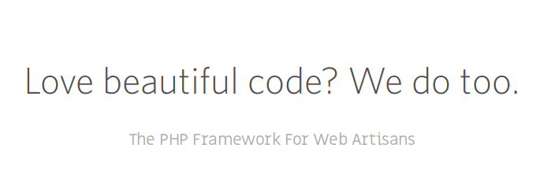
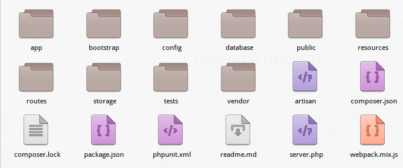
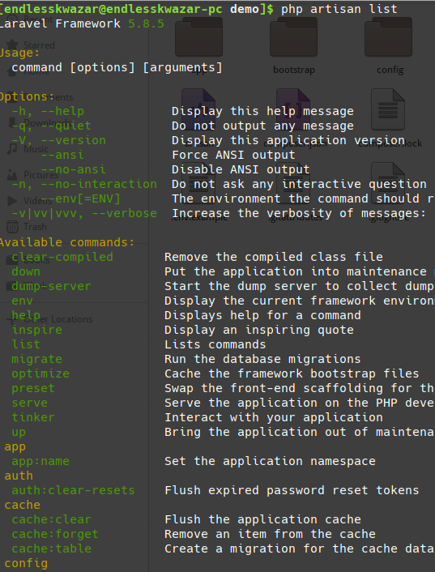
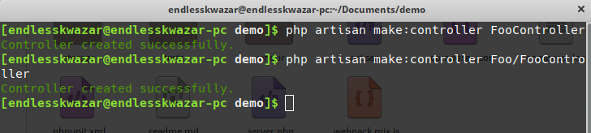

# Laravel

# Зміст

${toc}

# Laravel

**Laravel** - безкоштовний веб-фреймворк з відкритим кодом, призначений для розробки з використанням архітектурної моделі MVC (англ. Model View Controller - модель-уявлення-контролер). Laravel випущений під ліцензією MIT.


У 2015 році в результаті опитування sitepoint.com по використанню PHP-фреймворків серед програмістів зайняв перше місце в номінаціях:

- Фреймворк корпоративного рівня
- Фреймворк для особистих проектів
- Джерело антипаттернів



# Установка

Для того щою почати розробляти за допомогою Laravel зручно використовувати composer. Тоді для створення проекту достатньо виконати команду:

```bash
composer create-project --prefer-dist laravel/laravel blog
```



# Структура проекту

- **app** містить базовий код для вашої програми Laravel.
    - **Http** - Каталог Http містить різні фільтри, запити та контролери.
- **bootstrap** - містить скрипти для роутинга
- **config** - містить конфігураційні файли
- **database** - містить міграції, сіди
- **public** - Загальнодоступний каталог допомагає у запуску проекту Laravel, а також містить інші сценарії (JavaScript і CSS), а також зображення, необхідні для вашого проекту.
- **resources** - Каталог ресурсів містить всі файли Sass, мовні (локалізаційні) файли, шаблони (якщо такі є).
- **routes** - каталогів містить всі файли визначення для маршрутизації, такі як console.php, api.php, channels.php і т.д.
- **storage** - Каталог зберігає файли сеансів, кеш, скомпільовані шаблони, а також різні файли, що генеруються фреймворком.
- **test** - Директорія, яка містить тести: unit, інтеграційні

# Налаштування проекту

## ENV vs config

Часто необхідно мати різні значення для різних налаштувань в залежності від середовища, в якій виконується додаток. Наприклад, ви можете захотіти використовувати різні драйвера кешу на локальному та продакшн-сервері.

Для цього в Laravel використовується PHP-бібліотека DotEnv від Ванса Лукаса. У свіжої інсталяції Laravel в корені вашого застосування буде файл .env.example. Якщо ви встановили Laravel за допомогою Composer, цей файл буде автоматично перейменований в .env, інакше вам слід зробити це вручну.

Всі перераховані в цьому файлі змінні будуть завантажені в супер-глобальну змінну PHP $_ENV, коли ваш додаток отримає запит. Але ви можете використовувати допоміжну функцію env() для отримання значень цих змінних в ваших конфігураційних файлах. Насправді, якщо ви заглянете в файли налаштувань Laravel, то помітите кілька опцій, що вже використовують цю функцію:

'Debug' => env ( 'APP_DEBUG', false),

Другий аргумент цієї функції - значення за замовчуванням. Воно буде використано, якщо такий змінної середовища немає.

## Application key

Наступне, що потрібно зробити після встановлення Laravel - встановити ключ програми. Якщо ви встановили Laravel через Composer або інсталятор Laravel, цей ключ вже встановлено для вас ```php artisan key:generate```

Як правило, цей рядок повинен містити 32 символи. Ключ можна встановити у файлі середовища .env. Якщо ви не перейменували файл .env.example у .env, вам слід це зробити зараз. Якщо ключ програми не встановлено, користувацькі сесії та інші зашифровані дані не будуть захищені!

## База даних

Базу даних краще встановлювати в .env - фіайлі.

.env файл вже містить деякі параметри для з'єднання із базою даних:

```
DB_CONNECTION=mysql
DB_HOST=127.0.0.1
DB_PORT=3306
DB_DATABASE=homestead
DB_USERNAME=homestead
DB_PASSWORD=secret
```

Якщо, нас не влаштовують ці параметри їх потрібно перезаписати:

```
DB_CONNECTION=mysql
DB_HOST=127.0.0.1
DB_PORT=3306
DB_DATABASE=lara
DB_USERNAME=root
DB_PASSWORD=
```

# artisan

Artisan - це інтерфейс командного рядка, який включає в себе Laravel. Він надає ряд корисних команд, які допоможуть вам під час створення програми. Щоб переглянути список усіх доступних команд Artisan, можна скористатися командою list:

```
php artisan list
```



# Запуск Laravel - застосунка

Для запуска Laravel застосунка використовується команда:

```
php artisan serve
```

# Реєстрація, авторизація, аутентифікація

Laravel має вбудований функціонал реєстрації і авторизації. Для включення цього модуля достатньо виконати команду:

```
php artisan make:auth
```

Ця команда створить всі необхідні файли для реєстрації і авторизації

Для того, щоб реєстрація і авторизація працювала потрібно застосувати міграції:

```
php artisan migrate
```

**Щоб ця команда пройшла успішно потрібно мати налаштоване з'єднання із базою даних.**

# Маршрутизація

Всі маршрути (routes) Laravel визначені в файлах маршрутів, які розташовані в каталозі routes. Ці файли автоматично завантажуються фреймворком. У файлі routes/web.php визначені маршрути для вашого web-інтерфейсу. Ці маршрути входять в групу посередників web, які забезпечують такі можливості, як стан сесії і CSRF-захист.

Маршрутизатор дозволяє реєструвати маршрути для будь-якого HTTP-запиту:

```php
Route::get($uri, $callback);
Route::post($uri, $callback);
Route::put($uri, $callback);
Route::patch($uri, $callback);
Route::delete($uri, $callback);
Route::options($uri, $callback);
```

Іноді необхідно зареєструвати маршрут, який відповідає на HTTP-запити декількох типів. Це можна зробити шляхом match(). Або ви можете зареєструвати маршрут, який відповідає на HTTP-запити всіх типів, за допомогою методу any ():

```php
Route::match(['get', 'post'], '/', function () {
  //
});

Route::any('foo', function () {
  //
});
```

## Маршрут як функція

У Laravel найпростіші маршрути беруть URI (шлях) і функцію-замикання, надаючи дуже простий і виразний метод визначення маршрутів:

```php
Route::get('foo', function () {
  return 'Hello World';
});
```

## Передача параметра GET

### Обов'язкові параметри маршруту

Зрозуміло, іноді вам може знадобитися захопити сегменти URI в вашому маршруті. Наприклад, якщо вам необхідно захопити ID користувача з URL. Це можна зробити, визначивши параметри маршруту:

```php
Route::get('user/{id}', function ($id) {
  return 'User '.$id;
});
```

Ви можете визначити скільки завгодно параметрів:

```php
Route::get('posts/{post}/comments/{comment}', function ($postId, $commentId) {
  //
});
```

**Параметри маршруту завжди полягають у фігурні дужки і повинні складатися з буквених символів. Параметри маршруту не можуть містити символ -. Використовуйте замість нього підкреслення _.**

### Необов'язкові параметри маршруту

Іноді необхідно вказати параметр маршруту, але при цьому зробити його наявність необов'язковим. Це можна зробити, помістивши знак питання? після назви параметра. Не забудьте поставити значення за замовчуванням для відповідної змінної маршруту:

```php
Route::get('user/{name?}', function ($name = null) {
  return $name;
});

Route::get('user/{name?}', function ($name = 'John') {
  return $name;
});
```

### Обмеження регулярними виразами

Ви можете обмежити формат параметрів вашого маршруту за допомогою методу where() на примірнику маршруту. Метод where() приймає назву параметра і регулярний вираз, що визначає обмеження для параметра:

```php
Route::get('user/{name}', function ($name) {
  //
})->where('name', '[A-Za-z]+');

Route::get('user/{id}', function ($id) {
  //
})->where('id', '[0-9]+');

Route::get('user/{id}/{name}', function ($id, $name) {
  //
})->where(['id' => '[0-9]+', 'name' => '[a-z]+']);
```

# Контролери

Замість того, щоб визначити всю логіку обробки запитів як функцію у файлах маршруту, ви можете організувати цю поведінку за допомогою класів Controller. Контролери можуть групувати логіку обробки пов'язаних запитів в один клас. Контролери зберігаються в каталозі app/Http/Controllers.

## Створення контролера

Для генерації шаблону контролера можна використати команду:

```php
php artisan make:controller [Namespace][Name]Controller
```



## Маршрут як контроллер

Для створення маршруту до контролера, точніше до його методу використовується наступний синтаксис:

```php
Route::[httpMethod]('[route]', '[controller_name]@controller_method');
```

```php
Route::get('foo', 'FooController@index');
```

## Отримання POST - параметрів

### CSRF - token

«Класичний» сценарій атаки такий:
- Вася є залогіненним на сайт, припустимо, mail.com. У нього є сесія в куках.
- Вася потрапив на «злий» сайт, наприклад хакер запросив його зробити лист.
- На злій сторінці знаходиться форма такого виду:

```html
<form action="http://mail.com/send" method="POST">
  <input type="hidden" name="message" value="Сообщение">
  ...
</form>
```

- При заході на злу сторінку JavaScript викликає form.submit, відправляючи таким чином форму на mail.com.
- Сайт mail.com перевіряє куки, бачить, що відвідувач авторизований і обробляє форму. В даному прикладі форма передбачає посилку повідомлення.

Підсумок атаки - Вася, зайшовши на злу сторінку, ненароком відправив лист від свого імені. Вміст листа сформовано хакером.

Типовий спосіб захисту сайтів - це «секретний ключ» (secret), спеціальне значення, яке генерується випадковим чином і зберігається в сесії відвідувача. Його знає тільки сервер, відвідувачеві ми його навіть не будемо показувати.

Потім на основі ключа генерується «токен» (token). Токен робиться так, щоб з одного боку він був відмінний від ключа, зокрема, може бути багато токенов для одного ключа, з іншого - щоб було легко перевірити по токені, згенерований він на основі даного ключа чи ні.

Для кожного токена потрібно додаткове випадкове значення, яке називають «сіль» salt.

### Blade views

**Blade** - простий, але потужний шаблонизатор, що поставляється з Laravel. На відміну від інших популярних шаблонизатор для PHP Blade не обмежує вас у використанні чистого PHP-коду в ваших виставах. Насправді все уявлення Blade скомпільовані в чистий PHP-код і кеш, поки в них немає змін, а значить, Blade практично не навантажує вашу програму. Файли уявлень Blade використовують розширення .blade.php і зазвичай зберігаються в папці resources / views.

FooController.php:
```php
<?php

namespace App\Http\Controllers;

use Illuminate\Http\Request;

class FooController extends Controller
{
    public function index(){
        return "foo index";
    }

    public function edit(){
        return view('foo');
    }
}
```

foo.blade.php:
```html
<form method="post">

@csrf

<label for="">Name:</label>
<input type="text" name="name" /><br>

<input type="submit"/>

</form>
```

### Отримання POST - параметрів

Щоб отримати екземпляр поточного запиту HTTP через інжекцію залежностей, ви повинні набрати підказку класу Illuminate\Http\Request на своєму конструкторі або методі контролера. Поточний екземпляр запиту буде автоматично введений службовим контейнером:

routes:
```php
Route::get('/', function () {
    return view('welcome');
});

Auth::routes();

Route::get('/home', 'HomeController@index')->name('home');
Route::get('foo', 'FooController@index');
Route::get('foo/edit', 'FooController@edit');
Route::post('foo/edit', 'FooController@store');
```

FooController:
```php
<?php

namespace App\Http\Controllers;

use Illuminate\Http\Request;

class FooController extends Controller
{
    public function index(){
        return "foo index";
    }

    public function edit(){
        return view('foo');
    }

    public function store(Request $request){
        $name = $request->input("name");
        return $name;
    }
}
```


### Валідація запитів

Laravel поставляється з простою, зручною системою валідації (перевірки вхідних даних на відповідність правилам) і отримання повідомлень про помилки - класом Validation.

FooController:
```php
<?php

namespace App\Http\Controllers;

use Illuminate\Http\Request;

class FooController extends Controller
{
    public function index(){
        return "foo index";
    }

    public function edit(){
        return view('foo');
    }

    public function store(Request $request){
        $request::validate(
            array('name' => 'required'),
        );
    }
}
```

foo.blade.php:
```php
@if ($errors->any())
    <div class="alert alert-danger">
        <ul>
            @foreach ($errors->all() as $error)
                <li>{{ $error }}</li>
            @endforeach
        </ul>
    </div>
@endif

<form method="post">

@csrf

<label for="">Name:</label>
<input type="text" name="name" /><br>

<input type="submit"/>

</form>
```

### Перевизначення Request

Для більш складних сценаріїв перевірки можна створити "запит форми". Запити форми - це спеціальні класи запитів, які містять логіку перевірки. Щоб створити клас запиту форми, скористайтеся командою make:request:

```
php artisan make:request FooRequest
```

FooController:
```php
<?php

namespace App\Http\Controllers;

use Illuminate\Http\Request;
use App\Http\Requests\FooRequest;

class FooController extends Controller
{
    public function index(){
        return "foo index";
    }

    public function edit(){
        return view('foo');
    }

    public function store(FooRequest $request){

        // The incoming request is valid...

        // Retrieve the validated input data...
         $validated = $request->validated();
    }
}

```

# Blade

## Передача параметрів в blade

FooController:
```php
<?php

namespace App\Http\Controllers;

use Illuminate\Http\Request;
use App\Http\Requests\FooRequest;

class FooController extends Controller
{
    public function index(){
        return "foo index";
    }

    public function edit(){
        return view('foo');
    }

    public function store(FooRequest $request){

        // The incoming request is valid...

        // Retrieve the validated input data...
         $validated = $request->validated();

         $some1 = 1;
         $some2 = ['name', 'qwe'];

         return view('result', [
            'some1' => $some1,
            'some2' => $some2
         ]);
    }
}
```

result.blade.php:
```blade
{{ $some1 }}
```

## Умовні оператори

```blade
@if (count($records) === 1)
    I have one record!
@elseif (count($records) > 1)
    I have multiple records!
@else
    I don't have any records!
@endif
```

## Цикли

```blade
@for ($i = 0; $i < 10; $i++)
    The current value is {{ $i }}
@endfor

@foreach ($users as $user)
    <p>This is user {{ $user->id }}</p>
@endforeach
```

## Чистий php-код

```blade
@php
{{-- php code here --}}
@endphp
```

# Домашня робота

Створіть контролер, який приймає два запити: по GET - виводить форму, по POST - валідує і повертає користувачеві дані, які він ввів. Поля форми згідно із варіатом.

## Варіанти

1. {
    name: required, min-length:3,
    age: number, min-value:18
}
2. {
    title: required, max-length: 10,
    price: required, unsigned, cannot allow 0
}
3. {
    name: required
    car-number: need contain 6 digit
}
4. {
    appointment: required,
    patient_id: required, unsigned,
    doctor_id: required, unsigned
}
5. {
    phoneModel: required,
    is4Gsupported: required
}