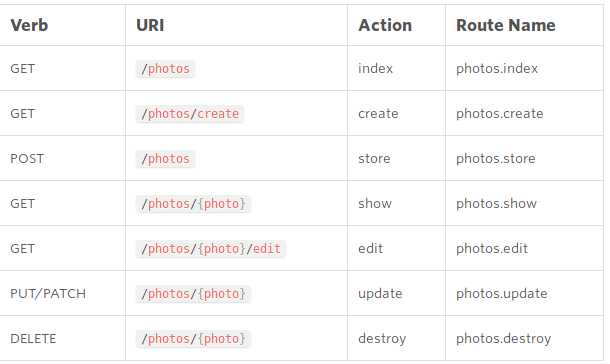

# Eluqolent

# Зміст

${toc}

# Active Record

**Active record** (AR) - шаблон проектування додатків, описаний Мартіном Фаулером в книзі Patterns of Enterprise Application Architecture ( «Шаблони архітектури корпоративних додатків»). AR є популярним способом доступу до даних реляційних баз даних в об'єктно-орієнтованому програмуванні.

Схема **Active Record** - це підхід до доступу до даних в базі даних. Таблиця бази даних або подання обгорнуті в класи. Таким чином, об'єктний екземпляр прив'язаний до єдиному рядку в таблиці. Після створення об'єкта новий рядок буде додаватися до таблиці на збереження. Будь завантажений об'єкт отримує свою інформацію від бази даних. Коли об'єкт оновлений, відповідний рядок в таблиці також буде оновлено. Клас обгортки реалізує методи засоби доступу або властивості для кожного стовпця в таблиці або поданні.

Реалізації цього шаблону часто порушують принцип єдиної відповідальності (SRP), поєднуючи в одному об'єкті як уявлення і внутрішню логіку самого об'єкта, так і механізми CRUD, тому Active Record може вважатися антипаттерном. В інших випадках це твердження спірне, так як сам по собі об'єкт, який реалізує ActiveRecord, який не містить ніякої бізнес-логіки, а надає таблицю з бази даних, має лише одну причину для зміни (зміна таблиці), що не суперечить визначенням принципу SRP.

## Приклад реалізації на PHP

```php
class Product {

	public static function newEmptyInstance() {
		return new self();
	}
	
	private $id;
	private $title;
	private $price;
	private $discount;
	private $description;
	
	private function __construct() {
	}
	
	public function getId() {
		return $this->id;
	}
	
	public function setTitle($aTitle) {
		$this->title = $aTitle;
	}
	
	public function getTitle() {
		return $this->title;
	}
	
	public function setPrice($aPrice) {
		$this->price = $aPrice;
	}
	
	public function getPrice() {
		return $this->price;
	}
	
	public function setDiscount($aDiscount) {
		$this->discount = $aDiscount;
	}
	
	public function getDiscount() {
		return $this->discount;
	}
	
	public function setDescription($aDescription) {
		$this->description = $aDescription;
	}
	
	public function getDescription() {
		return $this->description;
	}
}
```


```php
public function save() {
	if (isset($this->id)) {
		$this->_update();
	} else {
		$this->_insert();
	}
}

private function _update() {
	mysql_query("UPDATE `products` SET `title`='{$this->title}', "
		. "`price`='{$this->price}', `discount`='{$this->discount}', "
		. "`description`='{$this->description}' WHERE `id`={$this->id}");
}

private function _insert() {
	mysql_query("INSERT INTO `products` (`title`, `price`, `discount`, `description`)"
		. " VALUES ('{$this->title}', '{$this->price}', '{$this->discount}', '{$this->description}')");
	$new_id = mysql_insert_id();
	$this->id = $new_id;
}
```

```php
public static function find($aCount, $aOptFrom = null) {
	$lFrom = is_null($aOptFrom) ? '' : (int) $aOptFrom . ', ';
	$query = "SELECT `id` FROM `products` LIMIT {$lFrom}{$aCount}";
	$result = mysql_query($query);
	if ($result !== false) {
		$lReturnProducts = array();
		while ($row = mysql_fetch_array($result)) {
			$lReturnProducts[] = self::newInstance($row['id']);
		}
		return $lReturnProducts;
	} else {
		return false;
	}
}

public static function count() {
	$result = mysql_query("SELECT COUNT(`id`) as `count` FROM `products`");
	$row = mysql_fetch_array($result);
	$count = (int) $row['count'];
	return $count;
}

public static function newInstance($aId) {
	$lId = (int) $aId;
	if ($lId < 0 || $lId > PHP_INT_MAX) {
		return false;
	}
	$result = mysql_query("SELECT * FROM `products` WHERE `id`=" . $lId . " LIMIT 1");
	if ($result !== false) {
		$row = mysql_fetch_array($result);
		$product = new self();
		$product->id = $row['id'];
		$product->title = $row['title'];
		$product->price = $row['price'];
		$product->discount = $row['discount'];
		$product->description = $row['description'];
		return $product;
	} else {
		return false;
	}
}
```

# Eluqolent

Система об'єктно-реляційного відображення (ORM) **Eloquent** - красива і проста реалізація шаблону ActiveRecord в Laravel для роботи з базами даних. Кожна таблиця має відповідний клас-модель, який використовується для роботи з цією таблицею. Моделі дозволяють запитувати дані з таблиць, а також вставляти в них нові записи.

# migrations

Міграції схожі на систему контролю версій, але тільки для бази даних (БД). Вони дозволяють команді розробників легко змінювати схему БД додатки і ділитися цими змінами. Міграції зазвичай пов'язані з будівником схем Laravel (Laravel's schema builder) для полегшення створення схеми БД додатки.

Laravel Schema facade надає незалежну від БД підтримку створення та управління таблицями. Вона надає виразний API для всіх підтримуваних Laravel БД.

Для створення міграції використовуйте make: migration Artisan command:

```
php artisan make:migration create_users_table
```

Міграція буде поміщена в папку database / migrations. Кожне ім'я файлу міграції містить мітку часу, яка дозволяє Laravel визначати порядок застосування міграцій.

Опції --table і --create служать для завдання імені таблиці і вказівки чи міграція створювати нову таблицю. Простіше кажучи, ці опції служать для попереднього заповнення генерується файлу міграції:

```
php artisan make:migration add_votes_to_users_table --table=users
php artisan make:migration create_users_table --create=users
```

Клас міграції містить 2 методи: up і down. up потрібен для додавання нових таблиць, стовпців або індексів в БД, тоді як down просто скасовує операції, виконані в методі up.

```php
<?php

use Illuminate\Database\Schema\Blueprint;
use Illuminate\Database\Migrations\Migration;

class CreateFlightsTable extends Migration
{
    /**
     * Run the migrations.
     *
     * @return void
     */
    public function up()
    {
        Schema::create('flights', function (Blueprint $table) {
            $table->increments('id');
            $table->string('name');
            $table->string('airline');
            $table->timestamps();
        });
    }

    /**
     * Reverse the migrations.
     *
     * @return void
     */
    public function down()
    {
        Schema::drop('flights');
    }
}
```

Перелік доступних типів в класі конструкторі схеми:

|Команда|Пояснення|
|-|-|
|$table->bigIncrements('id');|Incrementing ID (primary key) using a "UNSIGNED BIG INTEGER" equivalent.|
|$table->bigInteger('votes');|BIGINT equivalent for the database.|
|$table->binary('data');|BLOB equivalent for the database.|
|$table->boolean('confirmed');|BOOLEAN equivalent for the database.|
|$table->char('name', 4);|CHAR equivalent with a length.|
|$table->date('created_at');|DATE equivalent for the database.|
|$table->dateTime('created_at');|DATETIME equivalent for the database.|
|$table->decimal('amount', 5, 2);|DECIMAL equivalent with a precision and scale.|
|$table->double('column', 15, 8);|DOUBLE equivalent with precision, 15 digits in total and 8 after the decimal point.|
|$table->enum('choices', ['foo', 'bar']);|ENUM equivalent for the database.|
|$table->float('amount');|FLOAT equivalent for the database.|
|$table->increments('id');|Incrementing ID (primary key) using a "UNSIGNED INTEGER" equivalent.|
|$table->integer('votes');|INTEGER equivalent for the database.|
|$table->json('options');|JSON equivalent for the database.|
|$table->jsonb('options');|JSONB equivalent for the database.|
|$table->longText('description');|LONGTEXT equivalent for the database.|
|$table->mediumInteger('numbers');|MEDIUMINT equivalent for the database.|
|$table->mediumText('description');|MEDIUMTEXT equivalent for the database.|
|$table->morphs('taggable');|Adds INTEGER taggable_id and STRING taggable_type.|
|$table->nullableTimestamps();|Same as timestamps(), except allows NULLs.|
|$table->rememberToken();|Adds remember_token as VARCHAR(100) NULL.|
|$table->smallInteger('votes');|SMALLINT equivalent for the database.|
|$table->softDeletes();|Adds deleted_at column for soft deletes.|
|$table->string('email');|VARCHAR equivalent column.|
|$table->string('name', 100);|VARCHAR equivalent with a length.|
|$table->text('description');|TEXT equivalent for the database.|
|$table->time('sunrise');|TIME equivalent for the database.|
|$table->tinyInteger('numbers');|TINYINT equivalent for the database.|
|$table->timestamp('added_on');|TIMESTAMP equivalent for the database.|
|$table->timestamps();|Adds created_at and updated_at columns.|
|$table->uuid('id');|UUID equivalent for the database.|

На додаток до типів, перерахованих вище, доступні модифікатори стовпців, які можна використовувати при додаванні стовпця. Додамо одну можливість приймати значення NULL:

```php
Schema::table('users', function ($table) {
    $table->string('email')->nullable();
});
```

Нижче наведений перелік доступних модифікаторів. Список не включає індексні модифікатори index modifiers:

|Команда|Пояснення|
|-|-|
|->first()|Place the column "first" in the table (MySQL Only)|
|->after('column')|Place the column "after" another column (MySQL Only)|
|->nullable()|Allow NULL values to be inserted into the column|
|->default($value)|Specify a "default" value for the column|
|->unsigned()|Set integer columns to UNSIGNED|

## relations

При створенні міграції ви можете вказати зовнішні ключі на ваших таблицях, тобто

```php
public function up()
{
    Schema::table('roles', function(Blueprint $table) {
        $table->increments('id');
        $table->integer('user_id')->unsigned();
        //rest of fields then...
        $table->foreign('user_id')->references('id')->on('users');
    });
}
```

# seed

Laravel має простий метод заповнення бази даних тестовими даними, використовуючи класи-наповнювачі (seed classes). Ці класи зберігаються в database / seeds. Можна використовувати будь-яке ім'я для назви класу-наповнювача, але розумним буде застосовувати імена, подібні UsersTableSeeder. За замовчуванням клас DatabaseSeeder вже створено в папці наповнювачів. В цьому класі ви можете використовувати метод call для запуску інших наповнювачів, що дозволяє вам контролювати порядок наповнення.

Для створення наповнювача можна використовувати команду make: seeder Artisan command. Команда створює наповнювач в папці database / seeds:

```
php artisan make:seeder UsersTableSeeder
```

За замовчуванням клас-наповнювач містить тільки один метод: run. Метод викликається, коли запускається команда db: seed Artisan command. У методі run ви можете вставляти дані в БД будь-яким зручним способом.

```php
<?php

use Illuminate\Database\Seeder;
use Illuminate\Database\Eloquent\Model;

class DatabaseSeeder extends Seeder
{
    /**
     * Run the database seeds.
     *
     * @return void
     */
    public function run()
    {
        DB::table('users')->insert([
            'name' => str_random(10),
            'email' => str_random(10).'@gmail.com',
            'password' => bcrypt('secret'),
        ]);
    }
}
```

У класі DatabaseSeeder можна використовувати метод call для запуску додаткових класів-наповнювачів. Метод call дозволити робити наповнення БД за допомогою безлічі файлів, не створюючи один великий клас-наповнювач. Просто передай методу бажаний клас-наповнювач для його запуску:

```php
/**
 * Run the database seeds.
 *
 * @return void
 */
public function run()
{
    $this->call(UsersTableSeeder::class);
    $this->call(PostsTableSeeder::class);
    $this->call(CommentsTableSeeder::class);
}
```

# models

Для початку створимо модель Eloquent. Моделі зазвичай розташовуються в папці app, але ви можете помістити їх в будь-яке місце, в якому працює автозавантажувач відповідно до вашим файлом composer.json. Всі моделі Eloquent успадковують клас Illuminate \ Database \ Eloquent \ Model.

Найпростіший спосіб створити екземпляр моделі - за допомогою Artisan-команди make: model:

```
php artisan make:model User
```

Якщо ви хочете створити міграцію БД при створенні моделі, використовуйте параметр --migration або -m:

```
php artisan make:model User --migration
php artisan make:model User -m
```

Зауважте, що ми не вказали, яку таблицю Eloquent повинен прив'язати до нашої моделі. Якщо це ім'я не вказано явно, то відповідно до прийнятого угодою буде використано ім'я класу в нижньому регістрі і в множині. У нашому випадку Eloquent припустить, що модель Flight зберігає свої дані в таблиці flights. Ви можете вказати довільну таблицю, визначивши властивість table в класі моделі:

```php
<?php

namespace App;

use Illuminate\Database\Eloquent\Model;

class Flight extends Model
{
  protected $table = 'my_flights';
}
```

## Get All

Після створення моделі і пов'язаної з нею таблиці, ви можете почати отримувати дані з вашої БД. Кожна модель Eloquent являє собою потужний конструктор запитів, що дозволяє зручно виконувати запити до пов'язаної таблиці. наприклад:

```php
<?php

use App\Flight;

$flights = App\Flight::all();

foreach ($flights as $flight) {
  echo $flight->name;
}
```

## Find

Зрозуміло, крім отримання всіх записів зазначеної таблиці ви можете також отримати конкретні записи за допомогою find() і first(). Замість колекції моделей ці методи повертають один примірник моделі:

```php
$flight = App\Flight::find(1);
$flight = App\Flight::where('active', 1)->first();
```

## Save

Для створення нового запису в БД просто створіть екземпляр моделі, задайте атрибути моделі і викличте метод save():

```php
$flight = new Flight;
$flight->name = $request->name;
$flight->save();
```

## Update

Метод save () можна використовувати і для зміни існуючої моделі в БД. Для зміни моделі вам потрібно отримати її, змінити необхідні атрибути і викликати метод save (). Відмітка часу updated_at (t) буде встановлена ​​автоматично, тому не треба ставити її вручну:

```php
$flight = App\Flight::find(1);
$flight->name = 'New Flight Name';
$flight->save();
```

## Delete

У попередньому прикладі ми отримали модель з БД перед викликом методу delete (). Але якщо ви знаєте первинний ключ моделі, ви можете видалити модель, не отримуючи її. Для цього викличте метод destroy ():

```php
App\Flight::destroy(1);
App\Flight::destroy([1, 2, 3]);
App\Flight::destroy(1, 2, 3);
```

Звичайно, ви також можете виконати оператор видалення на наборі моделей. У цьому прикладі ми видалимо всі рейси, відмічені неактивними. Подібно масового оновлення, масове видалення не викличе ніяких подій для видаляються моделей:

```php
$deletedRows = App\Flight::where('active', 0)->delete();
```

## relations

### one to one

Зв'язок виду «один до одного» є дуже простий. Наприклад, модель User може мати один Phone. Щоб визначити таке ставлення, ми поміщаємо метод phone () в модель User. Метод phone () повинен викликати метод hasOne () і повернути його результат:

```php
<?php

namespace App;

use Illuminate\Database\Eloquent\Model;

class User extends Model
{
  public function phone()
  {
    return $this->hasOne('App\Phone');
  }
}
```

Перший параметр, який передається hasOne (), - ім'я пов'язаної моделі. Як тільки ставлення встановлено, ви можете отримати до нього доступ через динамічні властивості Eloquent. Динамічні властивості дозволяють вам отримати доступ до функцій відносин, якби вони були властивостями моделі:

```php
$phone = User::find(1)->phone;
```

Eloquent визначає зовнішній ключ відносини по імені моделі. В даному випадку мається на увазі, що це user_id. Якщо ви хочете перекрити стандартне ім'я, передайте другий параметр методу hasOne ():

```php
return $this->hasOne('App\Phone', 'foreign_key');
```

### one to many

Ставлення «один до багатьох» використовується для визначення відносин, де одна модель володіє деякою кількістю інших моделей. Прикладом відносини «один до багатьох» є стаття в блозі, яка має «багато» коментарів. Як і інші відносини Eloquent ви можете змоделювати це відношення таким чином:

```php
<?php

namespace App;

use Illuminate\Database\Eloquent\Model;

class Post extends Model
{
  public function comments()
  {
    return $this->hasMany('App\Comment');
  }
}
```

Пам'ятайте, що Eloquent автоматично визначає стовпець зовнішнього ключа в моделі Comment. За угодою, Eloquent візьме «snake case» назви володіє моделі плюс _id. Таким чином, для даного прикладу, Eloquent передбачає, що зовнішнім ключем для моделі Comment буде post_id.

Після визначення відносини ми можемо отримати доступ до колекції коментарів, звернувшись до властивості comments. Пам'ятайте, що оскільки Eloquent підтримує «динамічні властивості», ми можемо звертатися до функцій відносин, як якщо б вони були визначені властивістю моделі:

```php
$comments = App\Post::find(1)->comments;

foreach ($comments as $comment) {
  //
}
```

Як і для методу hasOne () ви можете вказати зовнішній і локальний ключі, передавши додаткові параметри в метод hasMany ():

```php
return $this->hasMany('App\Comment', 'foreign_key');
return $this->hasMany('App\Comment', 'foreign_key', 'local_key');
```

### many to many

Відносини типу «багато до багатьох» складніше відносин hasOne () і hasMany (). Прикладом може служити користувач, який має багато ролей, де ролі також відносяться до багатьох користувачам. Наприклад, кілька користувачів можуть мати роль «Admin». Потрібні три таблиці для зв'язку з цим: users, roles і role_user. Ім'я таблиці role_user виходить з упорядкованих за алфавітом імен пов'язаних моделей, вона повинна мати поля user_id і role_id.

Ви можете визначити ставлення «багато до багатьох», написавши метод, який повертає результат методу belongsToMany (). Давайте визначимо метод roles () для моделі User:

```php
<?php

namespace App;

use Illuminate\Database\Eloquent\Model;

class User extends Model
{
  public function roles()
  {
    return $this->belongsToMany('App\Role');
  }
}
```

На додаток до завдання імені сполучної таблиці, ви можете також задати імена стовпців ключів в таблиці, передавши додаткові параметри методу belongsToMany (). Третій аргумент - це ім'я зовнішнього ключа моделі, на якій ви визначаєте відносини, в той час як четвертий аргумент - це зовнішній ключ моделі, з якою ви збираєтеся зв'язатися:

```php
return $this->belongsToMany('App\Role', 'role_user', 'user_id', 'role_id');
```


# Приклад проекта

## Інсталяція і налаштування проекта

Створіть новий laravel - проект:

```
composer create-project --prefer-dist laravel/laravel lara-db-ex
```

Налаштуйте з'єднання із базою даних:

.env:
```
DB_CONNECTION=mysql
DB_HOST=127.0.0.1
DB_PORT=3306
DB_DATABASE=laradbex
DB_USERNAME=root
DB_PASSWORD=
```

Створіть файли для авторизації:
```
php artisan make:auth
```

## Міграції

Створіть міграцію:
```
php artisan make:migration create_whish_table --create=wish
```

Код для міграції:

```php
public function up()
{
	Schema::create('wish', function (Blueprint $table) {
		$table->bigIncrements('id');
		$table->timestamps();
		$table->string('title', 100);

		//relation with user
		$table->unsignedBigInteger('user_id');
		$table->foreign('user_id')
				->references('id')->on('users')
				->onDelete('cascade');
	});
}
```

Виконайте міграції:
```
php artisan migrate
```

## Модель

Створіть модель Wish:
```
php artisan make:model Wish
```

Модифікуйте модель Wish наступним чином:
```php
class Wish extends Model
{
    protected $table = 'wish';

    public function user(){
        return $this->belongsTo('App\User');
    }
}
```

Модифікуйте модель User наступним чином:
```php
class User extends Authenticatable
{
	....
public function wishes(){
	return $this->hasMany('App\Wish');
}
	....
```

## Контролер

Згенеруйте контролер:

```
php artisan make:controller WishController --resource
```



Модифікуйте WishController наступним чином:
```php
<?php

namespace App\Http\Controllers;
use Illuminate\Support\Facades\Auth;
use App\Wish;
use App\User;

use Illuminate\Http\Request;

class WishController extends Controller
{

    public function __construct()
    {
        $this->middleware('auth');
    }

    /**
     * Display a listing of the resource.
     *
     * @return \Illuminate\Http\Response
     */
    public function index()
    {
        $list =  Auth::user()->wishes()->get();

        return view('wish/index', [
            'list' => $list
        ]);
    }

    /**
     * Show the form for creating a new resource.
     *
     * @return \Illuminate\Http\Response
     */
    public function create()
    {
        return view('wish/create');
    }

    /**
     * Store a newly created resource in storage.
     *
     * @param  \Illuminate\Http\Request  $request
     * @return \Illuminate\Http\Response
     */
    public function store(Request $request)
    {
        $wish = new Wish();
        $wish->title = $request->input("title");
        $wish->user()->associate(Auth::user());
        $wish->save();
        return redirect('wishes');
    }

    /**
     * Display the specified resource.
     *
     * @param  int  $id
     * @return \Illuminate\Http\Response
     */
    public function show($id)
    {
        //
    }

    /**
     * Show the form for editing the specified resource.
     *
     * @param  int  $id
     * @return \Illuminate\Http\Response
     */
    public function edit($id)
    {
        //
    }

    /**
     * Update the specified resource in storage.
     *
     * @param  \Illuminate\Http\Request  $request
     * @param  int  $id
     * @return \Illuminate\Http\Response
     */
    public function update(Request $request, $id)
    {
        //
    }

    /**
     * Remove the specified resource from storage.
     *
     * @param  int  $id
     * @return \Illuminate\Http\Response
     */
    public function destroy($id)
    {
        Wish::destroy($id);
        return redirect('wishes');  
    }
}

```

## Представлення

Створіть наступні предаствлення:

wish/index.blade.php
```html
@extends('layouts.app')

@section('content')
<div class="container">
    <div class="row justify-content-center">
        <div class="col-md-8">
            <div class="card">
                <div class="card-header">Wishes</div>

<a href="/wishes/create" class="btn btn-primary">Add wish</a>
<hr>
<table class="table table-striped">
<thead>
<th>Id</th>
<th>Title</th>
<th>Actions</th>
</thead>

<tbody>

@foreach ($list as $wish)
    <tr>
    <td>{{$wish->id}}</td>
    <td>{{$wish->title}}</td>
    <td>
        <form action="/wishes/{{$wish->id}}" method="POST">
        @csrf
        <input type="hidden" name="_method" value="DELETE">
            <input type="submit" class="btn btn-warning" value="Delete">
        </form>
    </td>
    </tr>
@endforeach

</tbody>
</table>

</div>
</div>
</div>
</div>
@endsection
```

wish/create.blade.php
```html
@extends('layouts.app')

@section('content')

<div class="container">
    <div class="row justify-content-center">
        <div class="col-md-8">
            <div class="card">
                <div class="card-header">Add wish</div>
<form method="post" action="/wishes">
@csrf
  <div class="form-group">
    <label>Title</label>
    <input type="text" name="title" class="form-control" placeholder="Name">
  </div>
  <button type="submit" class="btn btn-primary">Submit</button>
</form>
</div>
</div>
</div>
</div>
@endsection
```

## Маршрутизація

Створіть маршрут на контролер:

```php
Route::resource('wishes', 'WishController');
```

## Завантажити проект

- Знайти проект можна на рипозиторії [php-examples](https://github.com/endlesskwazar/php-examples)
- Гілка lara-db-ex

# Laravel Shema Designer

[Laravel Schema Designer](https://laravelsd.com/)

# Домашня робота

Доробіть проект з CRUD - операціями.