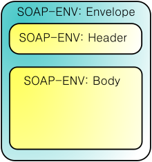

# Laravel Resources, JWT AUTH

# Зміст

${toc}

# Що таке Веб - сервіс

Коли ви вводите URL в браузер і отримуєте вебсайт.


При цьому, веб-сервіс  є поняттям більш розширеним у порівнянні з поняттям звичайного веб - сайта, він надає необроблену інформацію, і складний для більшості користувачів. Тому він використовується додатками. Ці додатки аналізують дані перед тим як повернути їх кінцевому користувачу.


Наприклад ви можете зайти на веб сторінку ABC, щоб подивитися інформацію про прогноз погоди і акції. Ця сторінка відобразить потрібну вам інформацію.

Щоб отримати дані прогнозу погоди, з додатком ABC потрібно взяти інформацію з певного ресурсу? це може веб сервіс, який надає дані погоди соответсвтующіе різних регіонах.

Індентичності, щоб отримати дані про акції, додаток ABC теж має зв'язати з веб сервісом надають ці дані. Дані будуть оброблені перед тим як повернути вам повний вебсайт.

Веб - сервіси часто надають необроблені дані, які складно зрозуміти більшості звичайних користувачів, вони зазвичай повертаються в форматі XML або JSON.

**Сервіс-орієнтована архітектура** (SOA, англ. Service-oriented architecture) - модульний підхід до розробки програмного забезпечення, заснований на використанні розподілених, слабо пов'язаних (англ. Loose coupling) замінних компонентів, оснащених стандартизованими інтерфейсами для взаємодії за стандартизованими протоколами.

## SOAP

**SOAP** (від англ. Simple Object Access Protocol - простий протокол доступу до об'єктів) - протокол обміну структурованими повідомленнями в розподіленої обчислювальної середовищі. Спочатку SOAP призначався в основному для реалізації віддаленого виклику процедур (RPC). Зараз протокол використовується для обміну довільними повідомленнями в форматі XML, а не тільки для виклику процедур.

SOAP є одним зі стандартів, на яких базуються технології веб-служб.

В SOAP сторони обмінюються SOAP - конвертами:



Приклад SOAP-запиту на сервер інтернет-магазину:

```xml
<?xml version="1.0" encoding="utf-8"?>
<soap:Envelope xmlns:xsi="http://www.w3.org/2001/XMLSchema-instance" xmlns:xsd="http://www.w3.org/2001/XMLSchema" xmlns:soap="http://schemas.xmlsoap.org/soap/envelope/">
   <soap:Body>
     <getProductDetails xmlns="http://warehouse.example.com/ws">
       <productID>12345</productID>
     </getProductDetails>
   </soap:Body>
</soap:Envelope>
```

Приклад відповіді:

```xml
<?xml version="1.0" encoding="utf-8"?>
<soap:Envelope xmlns:xsi="http://www.w3.org/2001/XMLSchema-instance" xmlns:xsd="http://www.w3.org/2001/XMLSchema" xmlns:soap="http://schemas.xmlsoap.org/soap/envelope/">
   <soap:Body>
     <getProductDetailsResponse xmlns="http://warehouse.example.com/ws">
       <getProductDetailsResult>
         <productID>12345</productID>
         <productName>Стакан граненый</productName>
         <description>Стакан граненый. 250 мл.</description>
         <price>9.95</price>
         <currency>
             <code>840</code>
             <alpha3>USD</alpha3>
             <sign>$</sign>
             <name>US dollar</name>
             <accuracy>2</accuracy>
         </currency>
         <inStock>true</inStock>
       </getProductDetailsResult>
     </getProductDetailsResponse>
   </soap:Body>
</soap:Envelope>
```

**WSDL** (англ. Web Services Description Language) - мова опису веб-сервісів і доступу до них, заснований на мові XML.

Кожен документ WSDL можна розбити на наступні логічні частини:

- визначення типів даних (types) - визначення виду відправлених і отриманих сервісом XML-повідомлень
- елементи даних (message) - повідомлення, що використовуються web-сервісом
- абстрактні операції (portType) - список операцій, які можуть бути виконані з повідомленнями
- зв'язування сервісів (binding) - спосіб, яким повідомлення буде доставлено

Приклад WSDL:

```xml
<message name="getTermRequest">
   <part name="term" type="xs:string"/>
</message>

<message name="getTermResponse">
   <part name="value" type="xs:string"/>
</message>

<portType name="glossaryTerms">
  <operation name="getTerm">
      <input message="getTermRequest"/>
      <output message="getTermResponse"/>
  </operation>
</portType>
```

[Реальний приклад WSDL](http://cs.au.dk/~amoeller/WWW/webservices/wsdlexample.html)

## RESTfull

Перші поняття про REST (REpresentational State Transfer) були введені в 2000 році в докторської дисертації Roy Thomas Fielding (співзасновник HTTP). У дисертації він детально знайомить з обмеженнями, правилами, як і зі способами виконання в системі для отримання системи REST.

REST визначає правила архітектури для дизайну ваших Web services, фокусується на систематичних ресурсах, включаючи якого формату стан ресурсів і передається по HTTP, і написаний різними мовами. Якщо порахувати за кількістю використовують веб сервісів, REST став популярним за минулі роки як сервіс моделі дизайну з перевагою. Насправді, REST має великий вплив і майже замінив SOAP і WSDL так як його набагато простіше і легше використовувати.

REST це набір правил для створення додатка Web Service, який слід 4 основним правилам дизайну:
- Використовувати явні методи HTTP
- Не має стану
- Відображає структуру папок як URls

## Використовувати явні методи HTTP

REST ставить правило, яке потребує проммістов визначити їх мета через метод HTTP. Зазвичай ці цілі включають отримання даних, вставити дані, оновлення даних або видалення даних. Тому коли ви хочете виконати одне із завдань вище, зауважте наступні правила:

Щоб створити ресурс на сервері, вам потрібно використовувати метод POST.
Для отримання ресурсу, використовуйте GET.
Щоб поміняти стан ресурсу або оновити його, використовуйте PUT.
Щоб скасувати або видалити ресурс, використовуйте DELETE.

Зауважте, що правила вище необов'язкові, насправді ви можете метод GET щоб отримати дані, вставляти, змінювати або видаляти дані на Сервері. Але REST дає правила вище які націлені всі прояснити і пояснити.


## Не має стану

Одне з властивостей REST це бути без стану (stateless), тобто він не зберігає інформацію клієнта. Наприклад ви відправляєте запит, щоб подивитися 2 сторінку документа, і Терера ви хочете подивитися наступну сторінку (сторінки 3). REST не зберігає інформацію про те, що він давав вам сторінку 2. Це означає REST не керує сесією (Session).

## Відображає структуру папок як URls

REST дає структуру щоб користувач міг мати доступ в власні ресурси через URL. Ресурси тут є всім, що ви можете назвати (Відео, фото, звіт погоди, ...)

Вам потрібно створити REST serivce щоб він повернув користувачеві відповідні ресурси.
Посилання REST service повинні бути інтуїтивними, щоб користувачі могли легко вгадати. Подумайте про посилання (URI) як про ясну підказку, яку легко можна вгадати, куди вона веде і які ресурси надає. Якщо коротко, структурі URI слід бути простий, легко вгадати і зрозуміти.

Best practices for urls:

**1. Використовувати множину**

Використовуйте множину для назви своїх REST сервісів. Це ще одна гаряча тема для обговорень серед REST дизайнерів - вибір між єдиними або множинними формами іменників для позначення сервісів.

Best Practice:

- /farmers
- /farmers/{farmer_id}
- /crops
- /crops/{crop_id}

Не рекомендуется:

- /farmer
- /farmer/{farmer_id}

**2. Версія вашого додатка**

Будь-яке програмне забезпечення розвивається з плином часу. Це може зажадати різних версій для всіх істотних змін в додатку. Коли справа доходить до версії REST додатки, то воно стає однією з найбільш обговорюваних тем серед спільноти розробників REST.

Приклад версіонування API:
- host/v2/farmers
- host/v1/farmers

**3. Моделювання зв'язків**

- users/{:id}/posts/{:id}/comments

**4. Ефективне використання HTTP Status Code**

HTTP визначає різні коди відповідей для вказівки клієнту різної інформації про операції. Ваше REST додаток могло б ефективно використовувати всі доступні HTTP-коди, щоб допомогти клієнту правильно налаштувати відповідь. Далі представлений список кодів відповідей HTTP:

- 200 OK - це відповідь на успішні GET, PUT, PATCH або DELETE. Цей код також використовується для POST, який не приводить до створення.
- 201 Created - цей код стану є відповіддю на POST, який призводить до створення.
- 204 Немає вмісту. Це відповідь на успішний запит, який не повертатиме тіло (наприклад, запит DELETE)
- 304 Not Modified - використовуйте цей код стану, коли заголовки HTTP-кешування знаходяться в роботі
- 400 Bad Request - цей код стану вказує, що запит спотворений, наприклад, якщо тіло не може бути проаналізовано
- 401 Unauthorized - Якщо не вказані або недійсні дані аутентифікації. Також корисно активувати спливаюче вікно auth, якщо програма використовується з браузера
- 403 Forbidden - коли аутентифікація пройшла успішно, але аутентіфіцированний користувач не має доступу до ресурсу
- 404 Not found - якщо запитується неіснуючий ресурс
- 405 Method Not Allowed - коли запитується HTTP-метод, який не вирішено для аутентифицированного користувача
- 410 Gone - цей код стану вказує, що ресурс в цій кінцевій точці більше не доступний. Корисно в якості захисного відповіді для старих версій API
- 415 Unsupported Media Type. Якщо в якості частини запиту було вказано неправильний тип вмісту
- 422 Unprocessable Entity - використовується для перевірки помилок
- 429 Too Many Requests - коли запит відхиляється через обмеження швидкості


# Laravel Resources

Під час побудови API вам може знадобитися шар перетворення, що знаходиться між вашими моделями Eloquent і відповідями JSON, які фактично повертаються користувачам вашої програми. Класи ресурсів Laravel дозволяють виразно і легко перетворювати ваші моделі і колекції моделей в JSON.

## Приклад проекту

Початкова структура:
- []()
- гілка - rest-ex1

1. Створіть новий ресурс:

```
php artisan make:resource Todo
```

Модифікуйте ресурс наступним чином:

```php
namespace App\Http\Resources;

use Illuminate\Http\Resources\Json\JsonResource;

class Todo extends JsonResource
{
    /**
     * Transform the resource into an array.
     *
     * @param  \Illuminate\Http\Request  $request
     * @return array
     */
    public function toArray($request)
    {
        return [
            'id' => $this->id,
            'title' => $this->title,
            'dueDate' => $this->due_date
        ];
    }
}
```

2. Створіть контролер

Створіть новий resource - контролер:

```
php artisan make:controller Api/V1/TodoController --resource
```

Модифікуйте контролер наступним чином:

```php
<?php

namespace App\Http\Controllers\Api\V1;

use Illuminate\Http\Request;
use App\Http\Controllers\Controller;
use App\Todo;
use App\Http\Resources\Todo as TodoResource;

class TodoController extends Controller
{
    /**
     * Display a listing of the resource.
     *
     * @return \Illuminate\Http\Response
     */
    public function index()
    {
        return TodoResource::collection(Todo::all()); 
    }

    /**
     * Store a newly created resource in storage.
     *
     * @param  \Illuminate\Http\Request  $request
     * @return \Illuminate\Http\Response
     */
    public function store(Request $request)
    {
        $todo = new Todo();
        $todo->title = $request->input('title');
        $todo->due_date = $request->input('dueDate');
        $todo->save();
        return new TodoResource($todo);
    }

    /**
     * Display the specified resource.
     *
     * @param  int  $id
     * @return \Illuminate\Http\Response
     */
    public function show($id)
    {
        return new TodoResource(Todo::find($id));
    }


    /**
     * Update the specified resource in storage.
     *
     * @param  \Illuminate\Http\Request  $request
     * @param  int  $id
     * @return \Illuminate\Http\Response
     */
    public function update(Request $request, $id)
    {
        $todo = Todo::find($id);
        $todo->title = $request->input('title');
        $todo->due_date = $request->input('dueDate');
        $todo->save();
        return new TodoResource($todo);
    }

    /**
     * Remove the specified resource from storage.
     *
     * @param  int  $id
     * @return \Illuminate\Http\Response
     */
    public function destroy($id)
    {
        Todo::destroy($id);
    }
}

```

3. Вимкніть CSRF для API

```php
namespace App\Http\Middleware;

use Illuminate\Foundation\Http\Middleware\VerifyCsrfToken as Middleware;

class VerifyCsrfToken extends Middleware
{
    /**
     * Indicates whether the XSRF-TOKEN cookie should be set on the response.
     *
     * @var bool
     */
    protected $addHttpCookie = true;

    /**
     * The URIs that should be excluded from CSRF verification.
     *
     * @var array
     */
    protected $except = [
        'api/*',
    ];
}
```

4. Додайте саршрути в api.php

```php
<?php

use Illuminate\Http\Request;

/*
|--------------------------------------------------------------------------
| API Routes
|--------------------------------------------------------------------------
|
| Here is where you can register API routes for your application. These
| routes are loaded by the RouteServiceProvider within a group which
| is assigned the "api" middleware group. Enjoy building your API!
|
*/

Route::middleware(['api'])->group(function (){
    Route::post('v1/todoes', 'Api\V1\TodoController@store');
    Route::get('v1/todoes/{id}', 'Api\V1\TodoController@show');
    Route::get('v1/todoes', 'Api\V1\TodoController@index');
    Route::put('v1/todoes/{id}', 'Api\V1\TodoController@update');
    Route::delete('v1/todoes/{id}', 'Api\V1\TodoController@destroy');
});
```

### Тестування

#### store


#### show


#### index


#### update


#### destroy


# JWT AUTH

