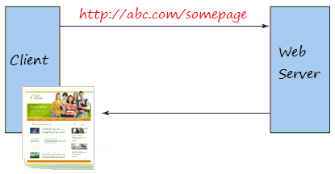
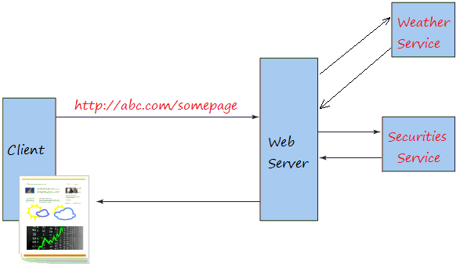
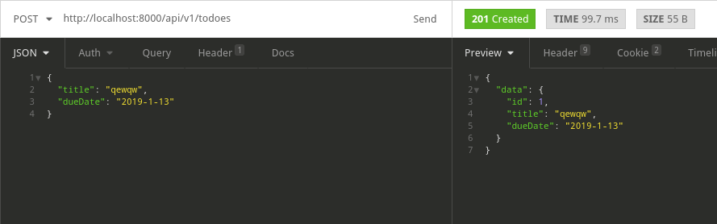
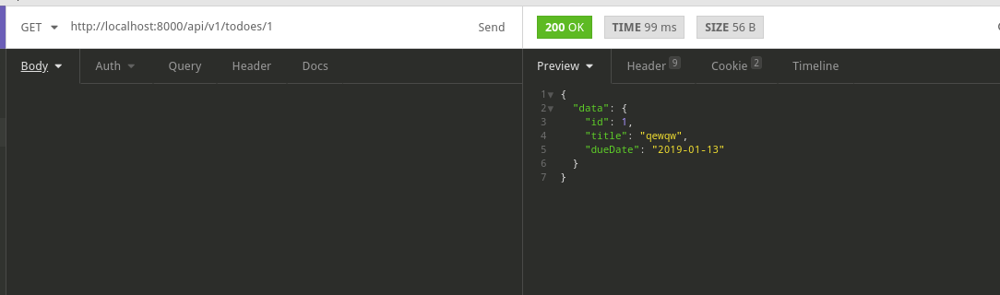
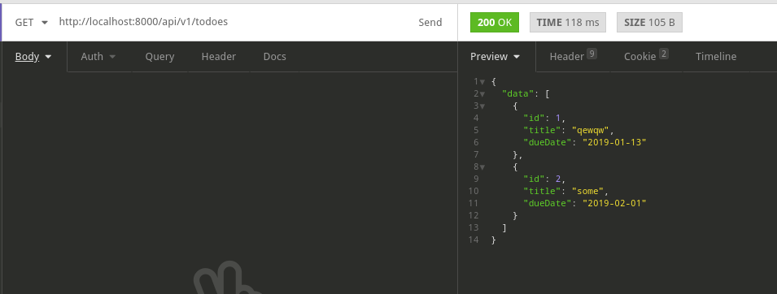
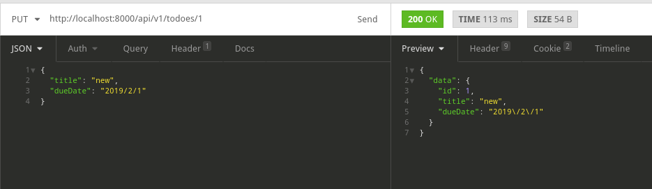
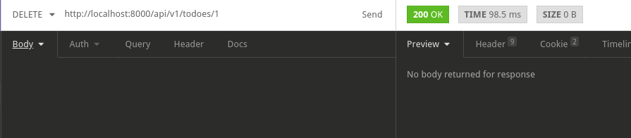

# Laravel Resources, JWT AUTH

# Зміст

${toc}

# Що таке Веб - сервіс

Коли ви вводите URL в браузер і отримуєте вебсайт.



При цьому, веб-сервіс  є поняттям більш розширеним у порівнянні з поняттям звичайного веб - сайта, він надає необроблену інформацію, і складний для більшості користувачів. Тому він використовується додатками. Ці додатки аналізують дані перед тим як повернути їх кінцевому користувачу.



Наприклад ви можете зайти на веб сторінку ABC, щоб подивитися інформацію про прогноз погоди і акції. Ця сторінка відобразить потрібну вам інформацію.

Щоб отримати дані прогнозу погоди, з додатком ABC потрібно взяти інформацію з певного ресурсу? це може веб сервіс, який надає дані погоди соответсвтующіе різних регіонах.

Індентичності, щоб отримати дані про акції, додаток ABC теж має зв'язати з веб сервісом надають ці дані. Дані будуть оброблені перед тим як повернути вам повний вебсайт.

Веб - сервіси часто надають необроблені дані, які складно зрозуміти більшості звичайних користувачів, вони зазвичай повертаються в форматі XML або JSON.

**Сервіс-орієнтована архітектура** (SOA, англ. Service-oriented architecture) - модульний підхід до розробки програмного забезпечення, заснований на використанні розподілених, слабо пов'язаних (англ. Loose coupling) замінних компонентів, оснащених стандартизованими інтерфейсами для взаємодії за стандартизованими протоколами.


# Laravel Resources

Під час побудови API вам може знадобитися шар перетворення, що знаходиться між вашими моделями Eloquent і відповідями JSON, які фактично повертаються користувачам вашої програми. Класи ресурсів Laravel дозволяють виразно і легко перетворювати ваші моделі і колекції моделей в JSON.

## Приклад проекту

Початкова структура:
- []()
- гілка - rest-ex1

1. Створіть новий ресурс:

```
php artisan make:resource Todo
```

Модифікуйте ресурс наступним чином:

```php
namespace App\Http\Resources;

use Illuminate\Http\Resources\Json\JsonResource;

class Todo extends JsonResource
{
    /**
     * Transform the resource into an array.
     *
     * @param  \Illuminate\Http\Request  $request
     * @return array
     */
    public function toArray($request)
    {
        return [
            'id' => $this->id,
            'title' => $this->title,
            'dueDate' => $this->due_date
        ];
    }
}
```

2. Створіть контролер

Створіть новий resource - контролер:

```
php artisan make:controller Api/V1/TodoController --resource
```

Модифікуйте контролер наступним чином:

```php
<?php

namespace App\Http\Controllers\Api\V1;

use Illuminate\Http\Request;
use App\Http\Controllers\Controller;
use App\Todo;
use App\Http\Resources\Todo as TodoResource;

class TodoController extends Controller
{
    /**
     * Display a listing of the resource.
     *
     * @return \Illuminate\Http\Response
     */
    public function index()
    {
        return TodoResource::collection(Todo::all()); 
    }

    /**
     * Store a newly created resource in storage.
     *
     * @param  \Illuminate\Http\Request  $request
     * @return \Illuminate\Http\Response
     */
    public function store(Request $request)
    {
        $todo = new Todo();
        $todo->title = $request->input('title');
        $todo->due_date = $request->input('dueDate');
        $todo->save();
        return new TodoResource($todo);
    }

    /**
     * Display the specified resource.
     *
     * @param  int  $id
     * @return \Illuminate\Http\Response
     */
    public function show($id)
    {
        return new TodoResource(Todo::find($id));
    }


    /**
     * Update the specified resource in storage.
     *
     * @param  \Illuminate\Http\Request  $request
     * @param  int  $id
     * @return \Illuminate\Http\Response
     */
    public function update(Request $request, $id)
    {
        $todo = Todo::find($id);
        $todo->title = $request->input('title');
        $todo->due_date = $request->input('dueDate');
        $todo->save();
        return new TodoResource($todo);
    }

    /**
     * Remove the specified resource from storage.
     *
     * @param  int  $id
     * @return \Illuminate\Http\Response
     */
    public function destroy($id)
    {
        Todo::destroy($id);
    }
}

```

3. Вимкніть CSRF для API

```php
namespace App\Http\Middleware;

use Illuminate\Foundation\Http\Middleware\VerifyCsrfToken as Middleware;

class VerifyCsrfToken extends Middleware
{
    /**
     * Indicates whether the XSRF-TOKEN cookie should be set on the response.
     *
     * @var bool
     */
    protected $addHttpCookie = true;

    /**
     * The URIs that should be excluded from CSRF verification.
     *
     * @var array
     */
    protected $except = [
        'api/*',
    ];
}
```

4. Додайте саршрути в api.php

```php
<?php

use Illuminate\Http\Request;

/*
|--------------------------------------------------------------------------
| API Routes
|--------------------------------------------------------------------------
|
| Here is where you can register API routes for your application. These
| routes are loaded by the RouteServiceProvider within a group which
| is assigned the "api" middleware group. Enjoy building your API!
|
*/

Route::middleware(['api'])->group(function (){
    Route::post('v1/todoes', 'Api\V1\TodoController@store');
    Route::get('v1/todoes/{id}', 'Api\V1\TodoController@show');
    Route::get('v1/todoes', 'Api\V1\TodoController@index');
    Route::put('v1/todoes/{id}', 'Api\V1\TodoController@update');
    Route::delete('v1/todoes/{id}', 'Api\V1\TodoController@destroy');
});
```

### Тестування

#### store



#### show



#### index



#### update



#### destroy



# JWT AUTH

