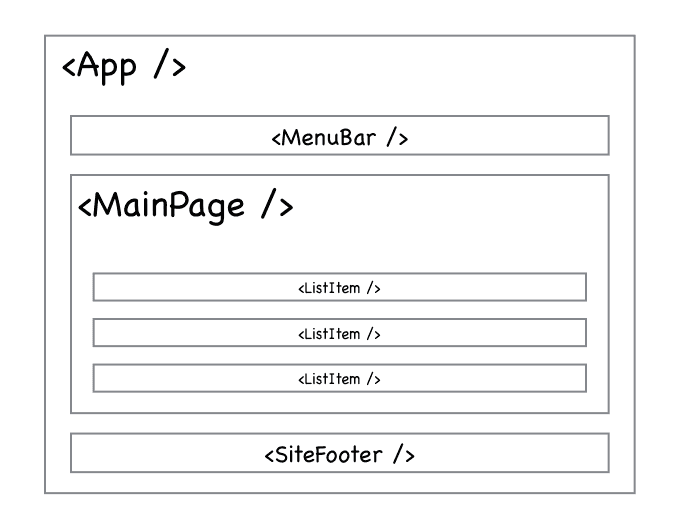

# SPA with React

# Зміст

${toc}

# create react app

**Create React App** - це офіційно підтримуваний спосіб створення односторінкових застосунків React. Він пропонує сучасні налаштування побудови без конфігурації.

```bash
npx create-react-app my-app
cd my-app
npm start
```


**Як працює створений проект**:

1. Завантажується index.html, який знаходиться в директорії public:

**index.html**
```html
...
 <body>
    <noscript>You need to enable JavaScript to run this app.</noscript>
    <div id="root"></div>
    <!--
      This HTML file is a template.
      If you open it directly in the browser, you will see an empty page.

      You can add webfonts, meta tags, or analytics to this file.
      The build step will place the bundled scripts into the <body> tag.

      To begin the development, run `npm start` or `yarn start`.
      To create a production bundle, use `npm run build` or `yarn build`.
    -->
  <script src="/static/js/bundle.js"></script><script src="/static/js/0.chunk.js"></script><script src="/static/js/main.chunk.js"></script></body>
  ...
```

2. Буде виконаний java-script bundle.js, який є конкатенаціює всіх скриптів проекту. Початкова точка index.js

3. За допомогою функції ReactDOM.render, ми знаходимо елемент з ідентифікатором root і відображаємо у ньому компонент, який описаний в App.js

```js
...
ReactDOM.render(<App />, document.getElementById('root'));
...
```

4. В компоненті App.js буде відображено, те що повиртає функція render

```js
class App extends Component {
  render() {
    return (
      <div className="App">
        <header className="App-header">
          
          <p>
            Edit <code>src/App.js</code> and save to reload.
          </p>
          <a
            className="App-link"
            href="https://reactjs.org"
            target="_blank"
            rel="noopener noreferrer"
          >
            Learn React
          </a>
        </header>
      </div>
    );
  }
}
```

# components

**Компоненти** дозволяють вам розділити UI на незалежні частини і працювати з кожною з них окремо.

Концептуально, компоненти подібні JavaScript-функціям. Вони приймають довільні дані (звані props) і повертають React-елементи, що описують що має з'явитися на екрані.



1. Функціональниі компоненти

```js
const Greeting = () => <h1>Hello World today!</h1>;
```

2. Компонент - клас

```js
class Greeting extends React.Component {
  render(){
    return <h1>Hello World Today!</h1>;
  }
}
```

# components lifecycle

Lifecycle Methods

|Функція|Пояснення|
|-|-|
|componentWillMount|виконується до рендеринга, як на сервері, так і на стороні клієнта.|
|componentDidMount|виконується після першої візуалізації тільки на стороні клієнта.|
|shouldComponentUpdate|має повернути значення true або false. Це визначить, чи буде компонент оновлюватися чи ні.|
|componentWillUpdate|визивається безпосередньо перед відтворенням|
|componentDidUpdate|викликається відразу після рендеринга|
|componentWillUnmount|викликається після того, як компонент відключено від дому.|

```js
class Content extends React.Component {
   componentWillMount() {
      console.log('Component WILL MOUNT!')
   }
   componentDidMount() {
      console.log('Component DID MOUNT!')
   }
   shouldComponentUpdate(newProps, newState) {
      return true;
   }
   componentWillUpdate(nextProps, nextState) {
      console.log('Component WILL UPDATE!');
   }
   componentDidUpdate(prevProps, prevState) {
      console.log('Component DID UPDATE!')
   }
   componentWillUnmount() {
      console.log('Component WILL UNMOUNT!')
   }
   render() {
      return (
         <div>
            <h3>{this.props.myNumber}</h3>
         </div>
      );
   }
}
```

# react virtual dom

Головна проблема DOM - він ніколи не був розрахований для створення динамічного призначеного для користувача інтерфейсу (UI). Ми можемо працювати з ним, використовуючи JavaScript і бібліотеки на зразок jQuery, але їх використання не вирішує проблем з продуктивністю.
Подивіться на сучасні соціальні мережі, такі як Twitter, Facebook або Pinterest.
Після невеликого скролінгу, ми будемо мати десятки тисяч DOM-вузлів, ефективно взаємодіяти з якими - завдання не з легких.

Для прикладу, спробуйте перемістити 1000 div-блоків на 5 пікселів вліво.
Це може зайняти більше секунди - це занадто багато для сучасного інтернету. Ви можете оптимізувати скрипт і використовувати деякі прийоми, але в підсумку це викличе лише головний біль при роботі з величезними сторінками і динамічним UI.

**Virtual Dom**
Замість того, щоб взаємодіяти з DOM безпосередньо, ми працюємо з його легковагій копією. Ми можемо вносити зміни в копію, виходячи з наших потреб, а після цього застосовувати зміни до реального DOM.
При цьому відбувається порівняння DOM-дерева з його віртуальної копією, визначається різниця і запускається перерисовка того, що було змінено.


# state and props

## props

Це просто скорочення від властивостей. Props це механізм взаємодії між компонентами.

**App.js**
```js
...
class App extends Component {
  render() {
    return (
      <div className="App">
        {this.props.counter}
      </div>
    );
  }
}
...
```

**Index.js**
```js
...
ReactDOM.render(<App counter="1"/>, document.getElementById('root'));
...
```


## state

На агглійській «state of a being» відноситься до фізичного стану людини, і це просто стан, який змінюється з часом. Ну, подібно до стану в React / React Native використовується компонент для відстеження інформації.

```js
...
class App extends Component {

  componentWillMount(){
    this.state = {
      counter: 22
    }
  }

  render() {
    return (
      <div className="App">
        {this.state.counter}
      </div>
    );
  }
}
...
```


> 

    NEVER mutate this.state directly, as calling setState() afterwards may replace the mutation you made. Treat this.state as if it were immutable.

    setState() does not immediately mutate this.state but creates a pending state transition. Accessing this.state after calling this method can potentially return the existing value.

    There is no guarantee of synchronous operation of calls to setState and calls may be batched for performance gains.

    setState() will always trigger a re-render unless conditional rendering logic is implemented in shouldComponentUpdate(). If mutable objects are being used and the logic cannot be implemented in shouldComponentUpdate(), calling setState() only when the new state differs from the previous state will avoid unnecessary re-renders.


## state and props combination

**App.js**
```js
import React, { Component } from 'react';
import './App.css';
import  CounterDisplay from './CounterDisplay';

class App extends Component {

  componentWillMount(){
    this.state = {
      counter: 22
    }
  }

  render() {
    return (
      <div className="App">
        <CounterDisplay counter={this.state.counter} />
      </div>
    );
  }
}

export default App;
```

**CounterDisplay.js**
```js
import React, { Component } from 'react';

class CounterDisplay extends Component {

  render() {
    return (
      <div>
        <h1>Counter: {this.props.counter}</h1>
      </div>
    );
  }
}

export default CounterDisplay;
```


# react project structure


- src/components - Всі ваші презентаційні (aka Dumb components) компоненти йдуть сюди. Це прості компоненти без стану, які просто беруть дані із props.
- src/containers - Контейнерні компоненти йдуть сюди. Це ті, що підтримують стан, і ті, які здійснюють виклики API.
- src/utils - Ймовірно, вам знадобляться допоміжні функції як  обробники помилок, формати та подібні.


# json placeholder

JSONPlaceholder is a free online REST API that you can use whenever you need some fake data.
It's great for tutorials, testing new libraries, sharing code examples, ...

[JSONPlaceholder](https://jsonplaceholder.typicode.com/)

# app example
