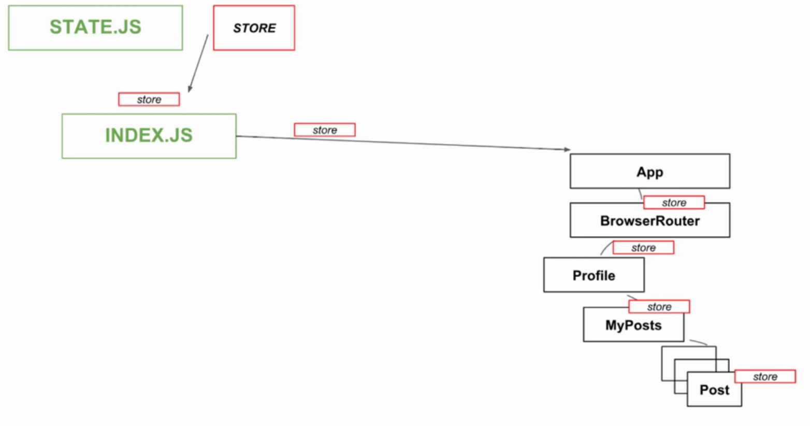
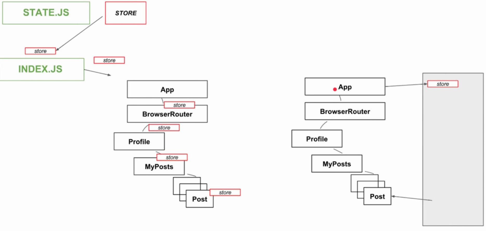
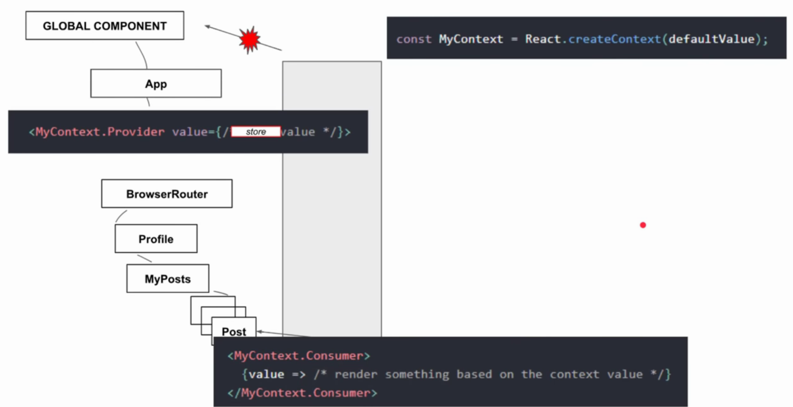

# react router, context api

# table of content

${toc}

# react hooks

Hooks - це функції, які дозволяють «зачепити» React - state та функції життєвого циклу функціональних компонентів. Hooks не працюють у класах - вони дозволяють використовувати React без класів.

State є невід'ємною частиною React. Він дозволяє нам оголошувати змінні, які містять дані, які, в свою чергу, будуть використовуватися в нашому додатку. За допомогою класів state зазвичай визначається наступним чином:

```js
class Example extends React.Component{
  constructor(props){
    super(props);
    this.state = {
      count: 0
    }
  }
}
```

## state hook

```js
import React, { useState } from 'react';

function Example() {
  const [count, setCount] = useState(0);

  return (
    <div>
      <p>You clicked {count} times</p>
      <button onClick={() => setCount(count + 1)}>
        Click me
      </button>
    </div>
  );
}
```

useState повертає пару: поточне значення стану і функцію, яка дозволяє оновити її. Ви можете викликати цю функцію з обробника подій або в іншому місці. Він подібний до цього .setState у класі, але він не об'єднує старе та нове стан.

Ви можете скористатися useState більше одного разу в одному компоненті:

```js
function ExampleWithManyStates() {
  const [age, setAge] = useState(42);
  const [fruit, setFruit] = useState('banana');
  const [todos, setTodos] = useState([{ text: 'Learn Hooks' }]);
}
```

## effect hook

useEffect, додає можливість виконувати side effects в функції. Він служить тій самій меті, що і componentDidMount, componentDidUpdate і componentWillUnmount в класах React, але уніфікований в один API.

```js
import React, { useState, useEffect } from 'react';

function Example() {
  const [count, setCount] = useState(0);

  useEffect(() => {
    document.title = `You clicked ${count} times`;
  });

  return (
    <div>
      <p>You clicked {count} times</p>
      <button onClick={() => setCount(count + 1)}>
        Click me
      </button>
    </div>
  );
}
```

## hooks rules

Hooks є функціями JavaScript, але вони накладають два додаткових правила:

- Викликати лише на верхньому рівні. Не викликайте hooks в циклах, умовах або вкладених функціях.
- Викликайте тільки з компонентів функції React. Не икликайте Hooks з регулярних функцій JavaScript.

# react router

1. Створіть новий react - проект, використовуючи create-react-app

2. Встановіть react router

```bash
npm install react-router-dom
```

3. Створіть новий компонент AppRouter
**AppRouter**:
```js
import React from "react";
import { BrowserRouter as Router, Route, Link } from "react-router-dom";

function Index() {
  return <h2>Home</h2>;
}

function About() {
  return <h2>About</h2>;
}

function Users() {
  return <h2>Users</h2>;
}

function AppRouter() {
  return (
    <Router>
      <div>
        <nav>
          <ul>
            <li>
              <Link to="/">Home</Link>
            </li>
            <li>
              <Link to="/about/">About</Link>
            </li>
            <li>
              <Link to="/users/">Users</Link>
            </li>
          </ul>
        </nav>

        <Route path="/" exact component={Index} />
        <Route path="/about/" component={About} />
        <Route path="/users/" component={Users} />
      </div>
    </Router>
  );
}

export default AppRouter;
```

example in app

# context api

У типовому React-додатку дані передаються зверху вниз (від батька до дочірньому компоненту) за допомогою пропсов. Однак, цей спосіб може бути надто громіздким для деяких типів пропсов (наприклад, вибрана мова, UI-тема), які необхідно передавати у багато компонентів в додатку. Контекст надає спосіб ділитися такими даними між компонентами без необхідності явно передавати пропси через кожен рівень дерева.








